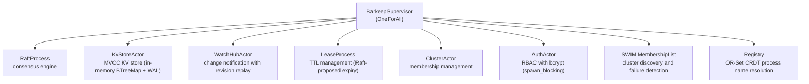
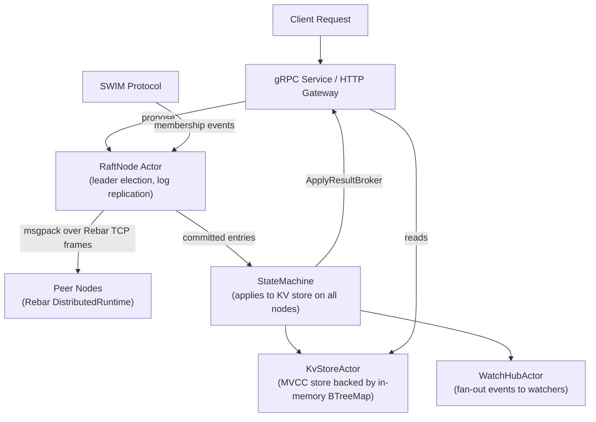

# barkeeper

A distributed key-value store built on the [Rebar](https://github.com/alexandernicholson/rebar) actor runtime with full v3 API compatibility (gRPC + HTTP/JSON gateway).

Raft consensus engine written from scratch as Rebar actors, in-memory BTreeMap KV store backed by an append-only WAL for durability. Single static binary, pure Rust.

## Status

| Component | Status |
|-----------|--------|
| v3 API | All KV, Watch, Lease, Cluster, Maintenance, Auth endpoints working |
| Raft Consensus | All writes go through Raft; multi-node via Rebar TCP transport |
| SWIM Membership | Cluster membership and failure detection via SWIM protocol |
| TLS | Auto-TLS and manual certificate support |
| Auth Enforcement | HTTP middleware + gRPC interceptor (bcrypt passwords) |
| Watch Notifications | Working, with revision-based replay |
| Lease Expiry | TTL-based expiry with key cleanup on revoke |
| Data Persistence | All nodes apply via state machine; survives restarts |
| Actor Runtime | Rebar |

## Features

- **v3 gRPC API** -- KV (Range, Put, DeleteRange, Txn, Compact), Watch, Lease, Cluster, Maintenance, Auth services
- **HTTP/JSON gateway** -- REST endpoints (`/v3/kv/put`, `/v3/kv/range`, `/v3/kv/compaction`, etc.)
- **Raft consensus on all writes** -- every KV mutation (put, delete, txn, compact) is proposed through Raft before being applied
- **Multi-node clustering** -- Rebar `DistributedRuntime` with TCP transport for inter-node Raft messaging; SWIM protocol for cluster membership discovery and failure detection
- **TLS support** -- auto-TLS (self-signed certificates generated at startup) and manual certificate configuration
- **Auth enforcement** -- when auth is enabled, HTTP middleware and gRPC interceptors validate tokens; bcrypt password hashing
- **MVCC key-value store** -- multi-version concurrency control with revision history and compaction
- **Transactions** -- compare-and-swap via Txn with version/value comparisons; watch notifications fire for transaction mutations
- **Watch notifications** -- real-time PUT/DELETE event streaming with prefix watching and revision-based replay (WatchHub replays history)
- **Lease expiry** -- Raft-proposed lease expiry for consistent cleanup across nodes; grant/revoke/keepalive/timetolive
- **Raft term in responses** -- all HTTP gateway responses include Raft term in headers
- **Rebar actor supervision** -- process supervision via BarkeepSupervisor (OneForAll strategy)
- **Cluster membership** -- member list, add, remove, update, promote
- **Auth (RBAC)** -- user/role/permission management with enforcement
- **Snapshots** -- chunked streaming snapshot over gRPC and HTTP for backup/recovery
- **Transport layer** -- Rebar TCP frames with msgpack serialization for multi-node Raft messaging
- **SWIM cluster membership** -- gossip-based failure detection and member discovery via SWIM protocol
- **DNS autodiscovery** -- Kubernetes StatefulSet support via DNS SRV resolution (bare hostname in `--initial-cluster` triggers DNS mode)
- **NodeDrain** -- three-phase graceful shutdown protocol for safe node removal
- **Registry** -- OR-Set CRDT for distributed process name resolution
- **Pure Rust** -- single static binary, no C dependencies

## Quick Start

### Build

```bash
cargo build --release
```

### Run a single-node cluster

```bash
./target/release/barkeeper
```

By default, barkeeper listens on:
- **gRPC**: `127.0.0.1:2379`
- **HTTP gateway**: `127.0.0.1:2380` (gRPC port + 1)
- **Peer traffic**: `localhost:2380`

### Test with curl (HTTP gateway)

```bash
# Put a key (values are base64-encoded)
curl -s -X POST http://127.0.0.1:2380/v3/kv/put \
  -d '{"key":"aGVsbG8=","value":"d29ybGQ="}'

# Get the key
curl -s -X POST http://127.0.0.1:2380/v3/kv/range \
  -d '{"key":"aGVsbG8="}'

# Delete the key
curl -s -X POST http://127.0.0.1:2380/v3/kv/deleterange \
  -d '{"key":"aGVsbG8="}'

# Grant a lease (TTL in seconds)
curl -s -X POST http://127.0.0.1:2380/v3/lease/grant \
  -d '{"TTL":60}'

# List leases
curl -s -X POST http://127.0.0.1:2380/v3/lease/leases \
  -d '{}'

# Cluster status
curl -s -X POST http://127.0.0.1:2380/v3/maintenance/status \
  -d '{}'

# List members
curl -s -X POST http://127.0.0.1:2380/v3/cluster/member/list \
  -d '{}'
```

### Test with etcdctl (gRPC)

```bash
ETCDCTL_API=3 etcdctl --endpoints=127.0.0.1:2379 put hello world
ETCDCTL_API=3 etcdctl --endpoints=127.0.0.1:2379 get hello
```

## Architecture

barkeeper is structured as a Rebar actor tree with supervised processes:





**Rebar supervision** -- the `BarkeepSupervisor` uses a OneForAll restart strategy, meaning if any child process crashes, all processes are restarted to maintain consistent state.

**Raft consensus** is implemented from scratch as a Rebar actor. A `RaftCore` pure state machine processes events and produces actions (persist, append, apply, send messages). The `RaftNode` actor wraps it with timers, channels, and a transport layer.

**SWIM membership** -- cluster membership discovery and failure detection use the SWIM gossip protocol. The `SWIM MembershipList` actor maintains a live view of cluster nodes and drives Raft reconfiguration when members join or leave. On Kubernetes, a bare hostname in `--initial-cluster` triggers DNS SRV resolution against the headless service to seed the SWIM ring.

**Rebar DistributedRuntime** -- inter-node Raft messages travel over TCP using Rebar frames with msgpack serialization. The `Registry` actor provides an OR-Set CRDT for distributed process name resolution across the cluster.

**State machine** receives committed log entries from Raft and applies them to the KV store on **all nodes** (leader and followers). This ensures consistent state across the cluster and data persistence across restarts. An `ApplyResultBroker` connects the state machine back to service handlers so leaders can return results to clients. The state machine also triggers watch notifications and manages lease key attachments.

**KvStoreActor** wraps the MVCC KV store as a Rebar actor. The KV store is an in-memory BTreeMap that serves as a materialized view of the append-only WAL, reconstructed from WAL replay (or snapshot) on startup. Implements revision-indexed storage where each mutation increments a global revision counter. Range queries can read at any historical revision. Compaction removes old revisions from the in-memory BTreeMaps.

**WatchHubActor** delivers real-time notifications for PUT and DELETE events as a Rebar actor. Supports exact-key and prefix-based watching, streaming events to connected watchers as keys change, with revision-based history replay.

**Lease manager** handles TTL-based key lifecycle. When a lease expires, all keys attached to it are automatically cleaned up. Supports grant, revoke, keepalive, and time-to-live queries.

**Storage** uses an in-memory BTreeMap state machine backed by an append-only WAL for durability. The KV store is a materialized view that can be reconstructed from WAL replay.

## Kubernetes Deployment

barkeeper supports automatic cluster formation on Kubernetes via DNS autodiscovery. Pass a bare hostname (no `ID=URL` prefix) to `--initial-cluster` and barkeeper will perform DNS SRV lookups against a headless service to discover peers.

### Headless Service

```yaml
apiVersion: v1
kind: Service
metadata:
  name: barkeeper
  namespace: default
spec:
  clusterIP: None
  selector:
    app: barkeeper
  ports:
    - name: client
      port: 2379
    - name: peer
      port: 2380
```

### StatefulSet

```yaml
apiVersion: apps/v1
kind: StatefulSet
metadata:
  name: barkeeper
  namespace: default
spec:
  serviceName: barkeeper
  replicas: 3
  selector:
    matchLabels:
      app: barkeeper
  template:
    metadata:
      labels:
        app: barkeeper
    spec:
      containers:
        - name: barkeeper
          image: barkeeper:latest
          args:
            - --name=$(POD_NAME)
            - --node-id=$(ORDINAL)
            - --listen-client-urls=0.0.0.0:2379
            - --listen-peer-urls=http://0.0.0.0:2380
            - --initial-cluster=barkeeper.default.svc.cluster.local
            - --initial-cluster-state=new
            - --data-dir=/data
          env:
            - name: POD_NAME
              valueFrom:
                fieldRef:
                  fieldPath: metadata.name
            - name: ORDINAL
              valueFrom:
                fieldRef:
                  fieldPath: metadata.labels['apps.kubernetes.io/pod-index']
          ports:
            - containerPort: 2379
              name: client
            - containerPort: 2380
              name: peer
          volumeMounts:
            - name: data
              mountPath: /data
  volumeClaimTemplates:
    - metadata:
        name: data
      spec:
        accessModes: [ReadWriteOnce]
        resources:
          requests:
            storage: 10Gi
```

When `--initial-cluster` is a bare hostname (`barkeeper.default.svc.cluster.local`), barkeeper resolves DNS SRV records for `_peer._tcp.<hostname>` to discover all StatefulSet pods and seeds the SWIM membership ring automatically.

## CLI Flags

| Flag | Default | Description |
|------|---------|-------------|
| `--name` | `default` | Human-readable name for this node |
| `--data-dir` | `data.barkeeper` | Path to data directory |
| `--listen-client-urls` | `127.0.0.1:2379` | gRPC listen address (HTTP gateway binds to port+1) |
| `--node-id` | `1` | Raft node ID |
| `--listen-peer-urls` | `http://localhost:2380` | URL to listen on for peer traffic |
| `--initial-cluster` | | Comma-separated cluster members (`1=http://10.0.0.1:2380,2=http://10.0.0.2:2380`), or a bare hostname to trigger DNS SRV autodiscovery (e.g. `barkeeper.default.svc.cluster.local`) |
| `--initial-cluster-state` | `new` | `new` for fresh cluster, `existing` to join |
| `--auto-tls` | `false` | Auto-generate self-signed certs for client connections |
| `--cert-file` | | Path to client server TLS cert file |
| `--key-file` | | Path to client server TLS key file |
| `--trusted-ca-file` | | Path to client server TLS trusted CA cert file |
| `--client-cert-auth` | `false` | Enable client certificate authentication |
| `--self-signed-cert-validity` | `1` | Validity period of self-signed certs (years) |
| `--peer-auto-tls` | `false` | Auto-generate self-signed certs for peer connections |
| `--peer-cert-file` | | Path to peer TLS cert file |
| `--peer-key-file` | | Path to peer TLS key file |
| `--peer-trusted-ca-file` | | Path to peer TLS trusted CA cert file |

## Supported APIs

### gRPC Services (port 2379)

| Service | RPCs | Status |
|---------|------|--------|
| KV | Range, Put, DeleteRange, Txn, Compact | Implemented |
| Watch | Watch (bidirectional stream) | Implemented |
| Lease | LeaseGrant, LeaseRevoke, LeaseKeepAlive, LeaseTimeToLive, LeaseLeases | Implemented |
| Cluster | MemberAdd, MemberRemove, MemberUpdate, MemberList, MemberPromote | Implemented |
| Maintenance | Status, Defragment, Alarm, Hash, Snapshot | Implemented |
| Auth | AuthEnable, UserAdd, UserGet, UserList, UserDelete, UserChangePassword, RoleAdd, RoleGet, RoleList, RoleDelete, RoleGrantPermission, RoleRevokePermission, UserGrantRole, UserRevokeRole | Implemented |

### HTTP/JSON Gateway (port 2380)

| Endpoint | Description |
|----------|-------------|
| `POST /v3/kv/put` | Put a key-value pair |
| `POST /v3/kv/range` | Get key(s) by key or key range |
| `POST /v3/kv/deleterange` | Delete key(s) |
| `POST /v3/kv/txn` | Transactional compare-and-swap |
| `POST /v3/kv/compaction` | Compact revision history |
| `POST /v3/lease/grant` | Grant a lease |
| `POST /v3/lease/revoke` | Revoke a lease |
| `POST /v3/lease/timetolive` | Query lease TTL |
| `POST /v3/lease/leases` | List all leases |
| `POST /v3/cluster/member/list` | List cluster members |
| `POST /v3/maintenance/status` | Cluster status |
| `POST /v3/maintenance/defragment` | Trigger database compaction |
| `POST /v3/maintenance/alarm` | Get/activate/deactivate alarms |
| `POST /v3/maintenance/snapshot` | Download database snapshot |
| `POST /v3/watch` | Watch keys via Server-Sent Events (SSE) |

Byte fields (key, value) are base64-encoded in JSON.

## Documentation

| Document | Description |
|----------|-------------|
| [System Architecture](docs/architecture.md) | Internal architecture, actor model, and data flow |
| [Deployment Guide](docs/deployment.md) | Deployment, multi-node clustering, TLS, Docker, systemd |
| [Developer Guide](docs/developer-guide.md) | Building, testing, and contributing |
| [Extension Guide](docs/extending.md) | Adding new services and actors |
| [Compatibility Reference](docs/etcd-compatibility.md) | API parity details |

## Tests

```bash
cargo test
```

257 tests across unit and integration test files covering Raft consensus, log store, KV store (MVCC, transactions, compaction), HTTP gateway API compatibility, watch notifications (including revision replay, progress notifications, compaction errors), lease expiry, TLS/mTLS configuration, auth enforcement (JWT), multi-node clustering, multi-node data replication, SWIM membership, registry CRDT, Rebar actor handles (KvStore, WatchHub, Auth, Cluster), gRPC transport, and kube-apiserver compatibility (range options, nested Txn, Hash/HashKV).

### Kubernetes Integration Test

Barkeeper can serve as the backing datastore for Kubernetes. The k3s integration test boots a real cluster against barkeeper and deploys workloads:

```bash
sudo bash k8s-test/k3s-integration.sh
```

This starts barkeeper, launches k3s with `--datastore-endpoint=http://127.0.0.1:2379`, then creates and verifies a pod, a 3-replica deployment, and a service with endpoint resolution. Requires sudo (k3s needs kubelet access); k3s is auto-installed if not present.

## Benchmarks

Single-node, native on tmpfs. Load via [oha](https://github.com/hatoo/oha) against HTTP/JSON gateway.

| Scenario | Barkeeper | etcd | Ratio |
|---|---|---|---|
| Write c=1 | 5,618 req/s | 2,340 req/s | **2.40x** |
| Write c=100 | 33,741 req/s | 16,210 req/s | **2.08x** |
| Read c=100 | 34,765 req/s | 16,149 req/s | **2.15x** |
| Read P99 | 6.43ms | 14.39ms | **2.2x faster** |
| Mixed read (c=80) | 24,281 req/s | 11,207 req/s | **2.17x** |
| Mixed write (c=20) | 5,456 req/s | 3,538 req/s | **1.54x** |
| Conn scaling c=1000 | 29,090 req/s | 16,959 req/s | **1.72x** |

Full results: [`bench/results/RESULTS.md`](bench/results/RESULTS.md)

```bash
# Run it yourself (requires oha)
bench/harness/run.sh all --native    # native with tmpfs (recommended)
bench/harness/run.sh all             # Docker containers
```

## Differences from etcd

barkeeper is a from-scratch implementation, not a fork of etcd. It aims for API compatibility, not code compatibility.

### Architecture (by design)

| | etcd | barkeeper |
|-|------|-----------|
| Language | Go | Rust |
| Concurrency | goroutines | Rebar actor runtime (BEAM-inspired) |
| Storage | bbolt (cgo) | Append-only WAL + in-memory BTreeMap (pure Rust) |

## Building from Source

### Prerequisites

- Rust 1.70+ (install via [rustup](https://rustup.rs))
- protoc (Protocol Buffers compiler)

On Ubuntu/Debian:

```bash
sudo apt install -y protobuf-compiler
```

On macOS:

```bash
brew install protobuf
```

### Build

```bash
git clone https://github.com/alexandernicholson/barkeeper.git
cd barkeeper
cargo build --release
```

The binary will be at `./target/release/barkeeper`.

## License

Apache License 2.0 -- see [LICENSE](LICENSE).

The protobuf definitions in `proto/` are vendored from [etcd](https://github.com/etcd-io/etcd) and are also licensed under Apache 2.0. See [proto/LICENSE](proto/LICENSE).

## Credits

- [etcd](https://github.com/etcd-io/etcd) -- the protocol buffer definitions and API design that barkeeper implements
- [Rebar](https://github.com/alexandernicholson/rebar) -- the BEAM-inspired actor runtime powering barkeeper's concurrency model
