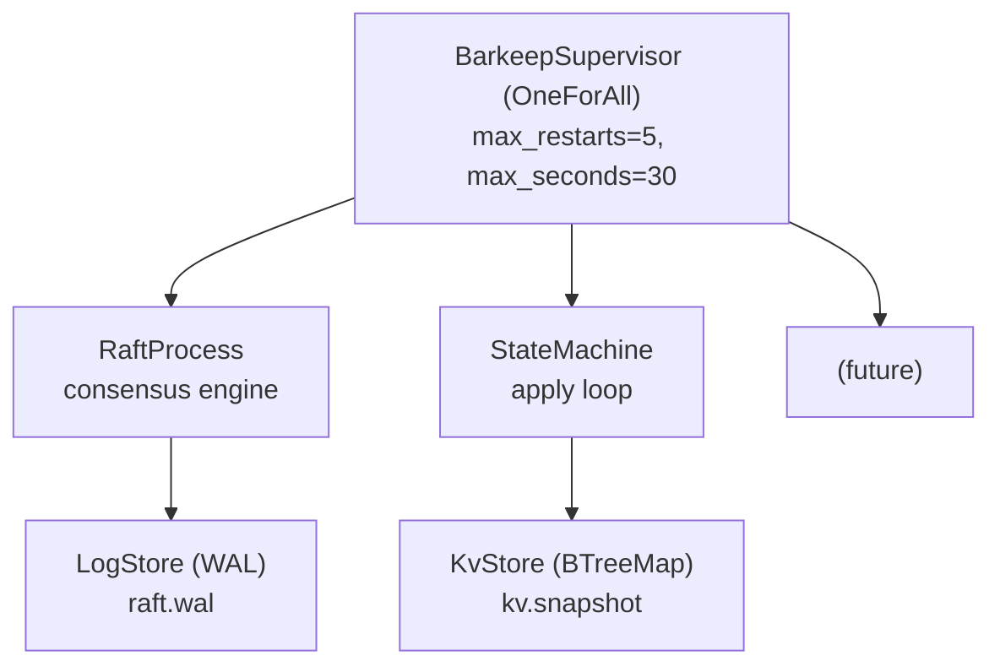
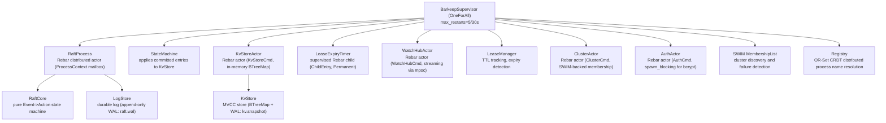
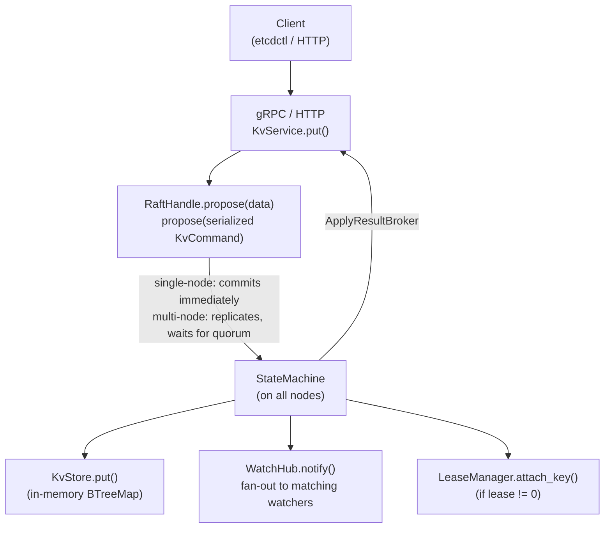
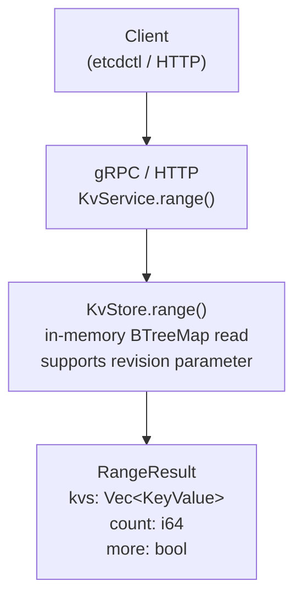
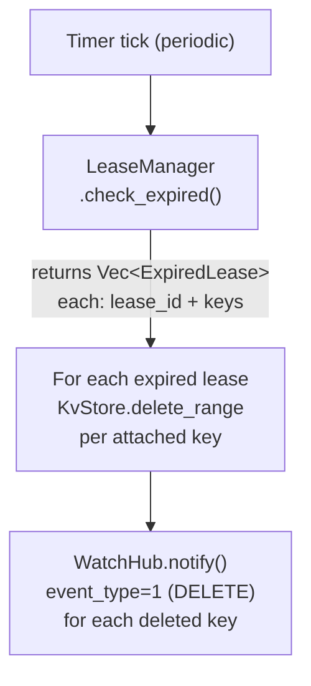
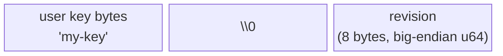
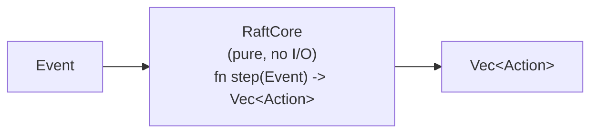
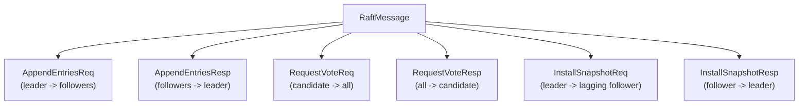
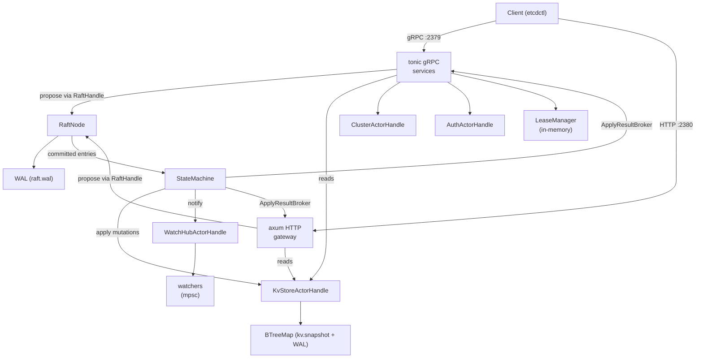

# Barkeeper Architecture

## System Overview

Barkeeper is an etcd-compatible distributed key-value store built on the
[Rebar](https://github.com/alexandernicholson/rebar) actor runtime. It aims to
provide full wire-level compatibility with etcd's gRPC and HTTP/JSON APIs while
using a fundamentally different internal architecture: supervised actor
processes communicating over typed channels rather than tightly-coupled
goroutines.

**Goals:**

- Drop-in replacement for etcd clients (gRPC + HTTP gateway)
- Raft consensus for linearizable writes
- MVCC storage with revision-based history
- Watch API for real-time change notification
- Lease-based TTL management
- RBAC authentication
- Crash recovery via Rebar supervision trees

**etcd API Surface Implemented:**

| API       | gRPC | HTTP Gateway |
|-----------|------|--------------|
| KV        | Yes  | Yes          |
| Watch     | Yes  | Yes (SSE at `/v3/watch`) |
| Lease     | Yes  | Yes          |
| Cluster   | Yes  | Yes          |
| Maintenance | Yes | Yes        |
| Auth      | Yes  | Yes          |

---

## Actor Process Tree

Barkeeper uses Rebar's `OneForAll` supervision strategy. If any child process
crashes, all siblings are restarted to maintain consistent state.



**Current actor layout:**



Actor command enums are defined in `src/actors/commands.rs`:
`RaftCmd`, `ClusterCmd`, `AuthCmd`, `KvStoreCmd`, `WatchHubCmd`. Each uses
`oneshot::Sender` for request-response patterns (except fire-and-forget
variants like `WatchHubCmd::Notify`).

The SWIM protocol runs in a dedicated `tokio::spawn` tick loop alongside the
supervisor tree. It gossips with peer nodes to maintain a live cluster view.
The `Registry` holds an OR-Set CRDT shared across all nodes via the Rebar
`DistributedRuntime`, providing eventually-consistent distributed process
name resolution (e.g. `raft:{node_id}` → `ProcessId`).

---

## Write Path

All writes flow through Raft consensus before being applied to the KV store.
The service layer serializes a `KvCommand`, proposes it through `RaftHandle`,
and waits for the state machine to apply it. The state machine is the single
source of truth for KV mutations on **all nodes** (leader and followers),
ensuring consistent state across the cluster and data persistence across
restarts.



The state machine (`spawn_state_machine`) receives committed entries from Raft
and applies them to the KV store, triggers watch notifications, and manages
lease key attachments. An `ApplyResultBroker` connects the state machine back
to the service handler so that the leader can return results to clients.

On restart, the state machine tracks `last_applied_raft_index` (persisted in
the KV store's meta table) to skip entries that were already applied, preventing
double-application when Raft replays committed entries.

---

## Read Path

Reads are served directly from the KV store without going through Raft.
This matches etcd's serializable read behaviour (the default for `Range`).



Range queries support:

- **Single key:** `range_end` is empty
- **Key range:** keys in half-open interval `[key, range_end)`
- **All keys:** `key = "\x00"`, `range_end = "\x00"`
- **Historical reads:** non-zero `revision` parameter reads at that point in time
- **Pagination:** `limit` parameter with `more` flag in response

---

## Lease Expiry Flow

Leases are tracked in-memory by the `LeaseManager`. Each lease has a TTL
(seconds) and a set of attached keys. The expiry check runs on a timer.



**LeaseManager internals:**

```rust
LeaseEntry {
    id: i64,
    ttl: i64,              // granted TTL in seconds
    granted_at: Instant,   // reset on keepalive
    keys: Vec<Vec<u8>>,    // attached keys
}

// Expired when: granted_at.elapsed().as_secs() >= ttl
```

Lease lifecycle:

1. `LeaseGrant` -- creates a `LeaseEntry` with TTL
2. `Put` with `lease != 0` -- calls `attach_key(lease_id, key)`
3. `LeaseKeepAlive` -- resets `granted_at` to `Instant::now()`
4. Timer fires `check_expired()` -- removes expired entries, returns keys
5. Keys are deleted from `KvStore`, watchers are notified

---

## MVCC Storage Model

Barkeeper implements Multi-Version Concurrency Control (MVCC) using compound
keys in in-memory BTreeMaps. Every mutation creates a new revision, preserving history.

### Compound Key Format



- The `\x00` separator byte divides the user key from the revision
- Big-endian encoding ensures lexicographic ordering matches numeric ordering
- Multiple revisions of the same key sort together, latest last

**Helper functions:**

```rust
make_compound_key(key, revision) -> Vec<u8>   // build compound key
extract_user_key(compound)       -> &[u8]     // everything before last 9 bytes
extract_revision(compound)       -> u64       // last 8 bytes as BE u64
```

### In-Memory BTreeMaps

| BTreeMap    | Key Type        | Value Type                     | Purpose                        |
|-------------|-----------------|--------------------------------|--------------------------------|
| `kv`        | `Vec<u8>`       | `InternalKeyValue` (JSON)      | MVCC key-value data            |
| `revisions` | `u64`           | `Vec<RevisionEntry>` (JSON)    | Which keys changed per revision|
| `latest`    | `Vec<u8>`       | `u64`                          | Latest revision per user key   |
| `meta`      | `String`        | `Vec<u8>`                      | Current revision counter       |

All BTreeMaps are held behind an `RwLock` and backed by an append-only WAL for durability. On startup, the KV store is reconstructed from a `kv.snapshot` file (if present) or by replaying the WAL.

### InternalKeyValue

```rust
InternalKeyValue {
    key: Vec<u8>,
    create_revision: i64,   // revision when key was first created
    mod_revision: i64,      // revision of this version
    version: i64,           // version counter (0 = tombstone)
    value: Vec<u8>,
    lease: i64,             // 0 = no lease
}
```

### Revision Lifecycle

1. **Put (new key):** `create_revision = new_rev`, `version = 1`
2. **Put (existing key):** `create_revision` preserved, `version += 1`
3. **Delete:** tombstone written with `version = 0`, `create_revision = 0`
4. **Compact(rev):** removes all but the latest entry per key at or before `rev`

### Compaction

Compaction removes historical versions while preserving the latest state:

```
Before compact(3):
  key="a" rev=1  value="v1"   <-- removed
  key="a" rev=2  value="v2"   <-- removed
  key="a" rev=3  value="v3"   <-- kept (latest at compact rev)
  key="a" rev=5  value="v5"   <-- kept (after compact rev)

After compact(3):
  key="a" rev=3  value="v3"
  key="a" rev=5  value="v5"
```

---

## Raft Consensus

### Event-Action Pure State Machine

The Raft implementation follows a clean separation between the pure state
machine (`RaftCore`) and the side-effecting actor shell. `RaftCore` contains
zero async code and no I/O -- it takes `Event` values and returns `Vec<Action>`.



**Events (inputs):**

| Event              | Source                      |
|--------------------|-----------------------------|
| `Initialize`       | Startup (restored state)    |
| `ElectionTimeout`  | Timer expiry                |
| `HeartbeatTimeout`  | Timer expiry (leader only) |
| `Proposal`         | Client write request        |
| `Message`          | Peer Raft RPC               |

**Actions (outputs):**

| Action                | Side Effect                          |
|-----------------------|--------------------------------------|
| `SendMessage`         | Transmit RPC to peer node            |
| `PersistHardState`    | Write term/votedFor to WAL           |
| `AppendToLog`         | Append entries to log store          |
| `TruncateLogAfter`    | Remove conflicting log entries       |
| `ApplyEntries`        | Apply committed entries to KV store  |
| `ResetElectionTimer`  | Restart randomized election timeout  |
| `StartHeartbeatTimer` | Begin periodic heartbeat sending     |
| `StopHeartbeatTimer`  | Stop heartbeat (stepped down)        |
| `RespondToProposal`   | Reply to client with result          |

### Raft State

```rust
RaftState {
    node_id: u64,
    role: Follower | Candidate | Leader,
    persistent: {           // survives restart (WAL)
        current_term: u64,
        voted_for: Option<u64>,
    },
    volatile: {             // all servers
        commit_index: u64,
        last_applied: u64,
    },
    leader_state: Option<{  // leader only
        next_index: HashMap<u64, u64>,
        match_index: HashMap<u64, u64>,
    }>,
    voters: HashSet<u64>,
    learners: HashSet<u64>,
}
```

### Log Store

The durable Raft log uses an append-only WAL (`raft.wal`):

- `raft_log`: `u64 (index) -> JSON LogEntry`
- `raft_meta`: `"hard_state" -> JSON PersistentState`

Operations: `append`, `get`, `get_range`, `truncate_after`, `last_index`,
`last_term`, `save_hard_state`, `load_hard_state`.

### Transport

The `RaftTransport` trait abstracts inter-node messaging:

```rust
#[async_trait]
pub trait RaftTransport: Send + Sync {
    async fn send(&self, to: u64, message: RaftMessage);
}
```

**Implementations:**

| Transport                    | Use Case                                           |
|------------------------------|----------------------------------------------------|
| `LocalTransport`             | In-process multi-node testing                      |
| `RebarTcpTransport`          | Multi-node clusters via Rebar DistributedRuntime   |

Inter-node Raft messages are serialized with msgpack and carried over Rebar
TCP frames by the `RebarTcpTransport`. The Rebar `DistributedRuntime` manages
the underlying TCP connections and multiplexes frames from different message
types on the same connection. This replaces the previous gRPC-based transport.

### SWIM Membership Flow

Cluster membership is maintained by the SWIM protocol rather than static
`--initial-cluster` peer lists (except during initial bootstrap):

1. On startup, each node seeds its SWIM ring from `--initial-cluster` peer
   addresses (or DNS SRV records when a bare hostname is supplied).
2. The `SWIM MembershipList` actor begins gossiping with reachable peers,
   exchanging membership state via periodic probe messages.
3. When a new node joins or an existing node becomes unreachable, SWIM
   propagates the change through the ring using a combination of direct
   probes and indirect probes via random intermediaries.
4. Membership change events (NodeJoined, NodeLeft, NodeSuspected) are
   delivered to the `RaftProcess`, which proposes configuration changes
   to the Raft log to keep consensus membership in sync.
5. The `NodeDrain` three-phase graceful shutdown protocol coordinates safe
   node removal: the draining node first transfers leadership (if leader),
   then removes itself from the Raft configuration, then stops SWIM gossip
   and closes TCP connections.

### Raft Messages



### Single-Node Fast Path

In a single-node cluster (`quorum_size() == 1`), the node immediately becomes
leader on the first election timeout and commits proposals without waiting for
follower acknowledgment.

---

## Technology Stack

| Concern              | etcd                    | Barkeeper                           |
|----------------------|-------------------------|-------------------------------------|
| Language             | Go                      | Rust                                |
| Actor Runtime        | goroutines              | Rebar (OneForAll supervisor)        |
| Consensus            | etcd/raft (Go lib)      | Custom RaftCore (Event->Action)     |
| Storage Engine       | bbolt (B+ tree)         | In-memory BTreeMap + append-only WAL (pure Rust) |
| gRPC Framework       | grpc-go                 | tonic                               |
| HTTP Gateway         | grpc-gateway            | axum (custom handler)               |
| Serialization        | protobuf                | prost (protobuf) + serde_json       |
| Async Runtime        | goroutine scheduler     | tokio                               |
| Inter-node Transport | gRPC streaming           | RebarTcpTransport (Rebar TCP frames, msgpack) |
| Cluster Membership   | peer URL exchange        | SWIM protocol (gossip-based)        |
| Cluster Discovery    | peer URL exchange        | `--initial-cluster` CLI flag or DNS SRV autodiscovery |
| MVCC                 | Custom B-tree            | Compound keys in BTreeMap            |
| TLS                  | Manual + auto            | Manual + auto-TLS (rcgen)           |

---

## Module Reference

### `src/main.rs`
CLI entry point using clap. Parses `--name`, `--data-dir`,
`--listen-client-urls`, and `--node-id`. Delegates to `BarkeepServer::start()`.

### `src/actors/`

- **`commands.rs`** -- Command enums for actor communication: `RaftCmd`,
  `ClusterCmd`, `AuthCmd`, `KvStoreCmd`, `WatchHubCmd`. Each wraps a
  `oneshot::Sender` for request-response (except fire-and-forget variants
  like `WatchHubCmd::Notify`).

### `src/api/`

- **`server.rs`** -- `BarkeepServer::start()` wires all components: opens
  KvStore, initializes Rebar runtime and supervisor, spawns Raft node and state
  machine, creates all service instances, starts gRPC (tonic) and HTTP (axum)
  servers.
- **`kv_service.rs`** -- gRPC KV service: `Range`, `Put`, `DeleteRange`, `Txn`,
  `Compact`. Proposes writes through Raft, applies to KvStore after commit,
  notifies WatchHub on mutations, attaches keys to leases.
- **`watch_service.rs`** -- gRPC Watch service with bidirectional streaming.
  Creates/cancels watches via WatchHub, streams events back to clients.
- **`lease_service.rs`** -- gRPC Lease service: `LeaseGrant`, `LeaseRevoke`,
  `LeaseKeepAlive` (bidirectional streaming), `LeaseTimeToLive`, `LeaseLeases`.
- **`cluster_service.rs`** -- gRPC Cluster service: `MemberList`, `MemberAdd`,
  `MemberRemove`, `MemberUpdate`, `MemberPromote`.
- **`maintenance_service.rs`** -- gRPC Maintenance service: `Status`,
  `HashKV`, `Alarm` (GET/ACTIVATE/DEACTIVATE with in-memory alarm store),
  `Defragment` (no-op, kept for API compatibility), `Snapshot` (chunked 64KB streaming).
- **`auth_service.rs`** -- gRPC Auth service: `AuthEnable`, `AuthDisable`,
  `UserAdd`, `UserDelete`, `UserChangePassword`, `UserGrant`, `UserRevoke`,
  `UserList`, `UserGet`, `RoleAdd`, `RoleDelete`, `RoleGrant`, `RoleRevoke`,
  `RoleList`, `RoleGet`, `Authenticate`.
- **`gateway.rs`** -- HTTP/JSON gateway on port+1, matching etcd's
  grpc-gateway. Base64 key/value encoding, proto3 JSON rules (int64 as strings,
  default value omission).

### `src/raft/`

- **`core.rs`** -- Pure `Event -> Vec<Action>` Raft state machine. Handles
  elections, log replication, commit advancement. Zero async, zero I/O.
- **`node.rs`** -- `RaftHandle` and `spawn_raft_node()`. Wraps RaftCore in a
  tokio select loop handling election/heartbeat timers, client proposals, and
  inbound peer messages. Fills AppendEntries with log entries and prev_log_term
  from the LogStore before sending to followers.
- **`state.rs`** -- `RaftState`, `RaftRole` (Follower/Candidate/Leader),
  `PersistentState`, `VolatileState`, `LeaderState` (next_index/match_index).
- **`messages.rs`** -- `LogEntry`, `LogEntryData` (Command/ConfigChange/Noop),
  `RaftMessage` enum, all Raft RPC request/response types, `ClientProposal`.
  Includes msgpack encode/decode helpers for Rebar messaging.
- **`log_store.rs`** -- Durable log storage backed by an append-only WAL.
  append, get, get_range, truncate_after, hard state persistence.
- **`transport.rs`** -- `RaftTransport` trait and `LocalTransport`
  (in-process testing).
- **`rebar_transport.rs`** -- `RebarTcpTransport` for multi-node clusters via
  Rebar `DistributedRuntime`; Raft messages are msgpack-encoded and carried
  over Rebar TCP frames.
- **`snapshot.rs`** -- `SnapshotMeta` and `Snapshot` types for point-in-time
  state machine captures.

### `src/kv/`

- **`store.rs`** -- MVCC KvStore backed by in-memory BTreeMaps with an
  append-only WAL for durability. Compound key encoding, `put`, `range`,
  `delete_range`, `txn` (compare-and-swap), `compact`, `snapshot_bytes`
  (serialized snapshot). Uses four BTreeMaps: `kv`, `revisions`, `latest`,
  `meta`, all behind an `RwLock`.
- **`actor.rs`** -- `KvStoreActor` and `KvStoreActorHandle`. Rebar actor
  wrapping KvStore with typed `KvStoreCmd` commands. All KV operations
  are in-memory and do not require `spawn_blocking`.
- **`state_machine.rs`** -- `StateMachine` apply loop and `KvCommand` enum
  (Put/DeleteRange/Txn/Compact). Spawned via `spawn_state_machine()`, receives
  committed log entries from Raft over an mpsc channel. Applies mutations to
  the KV store, triggers watch notifications, and manages lease key attachments.
  Tracks `last_applied_raft_index` to skip already-applied entries on restart.
- **`apply_broker.rs`** -- `ApplyResultBroker` connects the state machine to
  service handlers via oneshot channels keyed by Raft log index. The state
  machine sends results after applying; service handlers wait for results to
  return to clients.

### `src/watch/`

- **`hub.rs`** -- `WatchEvent` type and `key_matches` utility function for
  exact key, range, and prefix matching.
- **`actor.rs`** -- `WatchHubActor` and `WatchHubActorHandle`. Rebar actor
  with typed `WatchHubCmd` commands. Maintains a `HashMap<i64, Watcher>`.
  `create_watch` returns a streaming `mpsc::Receiver<WatchEvent>`.
  `notify` is fire-and-forget with automatic dead watcher cleanup.

### `src/lease/`

- **`manager.rs`** -- In-memory `LeaseManager`. Methods: `grant`, `revoke`,
  `keepalive`, `time_to_live`, `list`, `attach_key`, `check_expired`.
  Leases are `HashMap<i64, LeaseEntry>` with TTL-based expiry detection.

### `src/cluster/`

- **`manager.rs`** -- `Member` type definition for cluster membership tracking.
- **`actor.rs`** -- `ClusterActor` and `ClusterActorHandle`. Rebar actor
  with typed `ClusterCmd` commands. Tracks members with peer/client URLs.
  Supports optional SWIM `MembershipSync` for peer discovery.
- **`swim.rs`** -- `SWIM MembershipList` actor. Implements the SWIM gossip
  protocol for cluster membership discovery and failure detection. Emits
  `MembershipEvent` notifications consumed by `RaftProcess`.
- **`registry.rs`** -- `Registry` actor backed by an OR-Set CRDT. Provides
  distributed process name resolution replicated across the cluster via
  the Rebar `DistributedRuntime`.

### `src/auth/`

- **`manager.rs`** -- `User`, `Role`, and `Permission` type definitions
  for the RBAC auth system.
- **`actor.rs`** -- `AuthActor` and `AuthActorHandle`. Rebar actor with
  typed `AuthCmd` commands (18 variants). bcrypt operations use
  `spawn_blocking` to avoid blocking the actor loop.
- **`interceptor.rs`** -- gRPC auth interceptor (`GrpcAuthLayer`). Validates
  tokens on all requests when auth is enabled; auth endpoints pass through.

### `src/tls.rs`

TLS certificate management. `TlsConfig` struct, `generate_self_signed()` for
auto-TLS, `build_tls_acceptor()` for HTTP, `build_tonic_tls()` for gRPC.

### `src/config.rs`

Configuration types (currently minimal, expanded as needed).

### `src/lib.rs`

Module declarations and protobuf includes via `tonic::include_proto!` for
`mvccpb`, `etcdserverpb`, and `authpb`.

---

## Data Flow Summary


