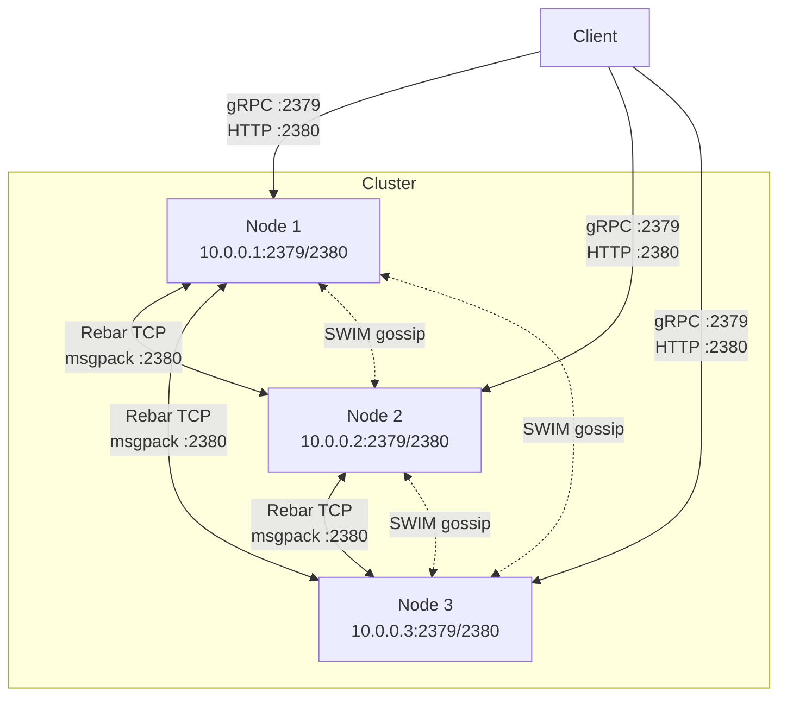
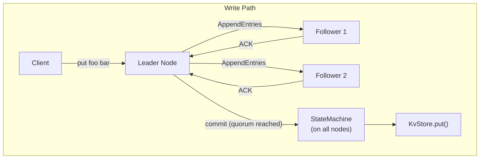

# Deployment Guide

This guide covers deploying barkeeper in production, including single-node
setup, multi-node clustering, TLS configuration, and operational best practices.

---

## Single-Node Deployment

A single-node cluster is the simplest deployment. All writes commit
immediately without waiting for follower acknowledgment.

### Build

```bash
cargo build --release
```

The binary is at `./target/release/barkeeper` (~15MB, statically linked, no
C dependencies).

### Run

```bash
./target/release/barkeeper \
  --listen-client-urls 0.0.0.0:2379 \
  --name node1 \
  --data-dir /var/lib/barkeeper \
  --node-id 1
```

This starts:
- **gRPC** on `0.0.0.0:2379`
- **HTTP gateway** on `0.0.0.0:2380` (always gRPC port + 1)

### Verify

```bash
# Via gRPC
etcdctl --endpoints=127.0.0.1:2379 put hello world
etcdctl --endpoints=127.0.0.1:2379 get hello

# Via HTTP
curl -s http://127.0.0.1:2380/v3/maintenance/status -d '{}' | jq .
```

---

## Multi-Node Cluster

A multi-node cluster provides fault tolerance through Raft consensus. A
3-node cluster tolerates 1 node failure; a 5-node cluster tolerates 2.



### Bootstrap a 3-Node Cluster

Each node needs to know all cluster members at startup via the
`--initial-cluster` flag. The format is `ID=PEER_URL` pairs separated by
commas.

**Node 1** (10.0.0.1):

```bash
./target/release/barkeeper \
  --node-id 1 \
  --name node1 \
  --listen-client-urls 0.0.0.0:2379 \
  --listen-peer-urls http://0.0.0.0:2380 \
  --initial-cluster "1=http://10.0.0.1:2380,2=http://10.0.0.2:2380,3=http://10.0.0.3:2380" \
  --initial-cluster-state new \
  --data-dir /var/lib/barkeeper
```

**Node 2** (10.0.0.2):

```bash
./target/release/barkeeper \
  --node-id 2 \
  --name node2 \
  --listen-client-urls 0.0.0.0:2379 \
  --listen-peer-urls http://0.0.0.0:2380 \
  --initial-cluster "1=http://10.0.0.1:2380,2=http://10.0.0.2:2380,3=http://10.0.0.3:2380" \
  --initial-cluster-state new \
  --data-dir /var/lib/barkeeper
```

**Node 3** (10.0.0.3):

```bash
./target/release/barkeeper \
  --node-id 3 \
  --name node3 \
  --listen-client-urls 0.0.0.0:2379 \
  --listen-peer-urls http://0.0.0.0:2380 \
  --initial-cluster "1=http://10.0.0.1:2380,2=http://10.0.0.2:2380,3=http://10.0.0.3:2380" \
  --initial-cluster-state new \
  --data-dir /var/lib/barkeeper
```

### Verify Cluster Health

```bash
# Check cluster membership from any node
etcdctl --endpoints=10.0.0.1:2379 member list

# Check maintenance status
curl -s http://10.0.0.1:2380/v3/maintenance/status -d '{}' | jq .

# Write to leader, read from any node
etcdctl --endpoints=10.0.0.1:2379,10.0.0.2:2379,10.0.0.3:2379 put hello world
etcdctl --endpoints=10.0.0.2:2379 get hello
```

### How It Works



1. Client sends a write to any node
2. If the node is not the leader, the client retries against other nodes
3. The leader proposes the write through Raft
4. The leader replicates the log entry to followers via `AppendEntries` RPCs
5. Once a quorum (majority) acknowledges, the entry is committed
6. The state machine on **all nodes** applies the command to their local KvStore
7. The leader returns the result to the client via the `ApplyResultBroker`

Data persists across pod restarts because each node's `kv.redb` contains all
applied mutations. The state machine tracks `last_applied_raft_index` to avoid
re-applying entries after restart.

### CLI Flags for Clustering

| Flag | Description |
|------|-------------|
| `--node-id` | Unique numeric ID for this node (must be unique across the cluster) |
| `--name` | Human-readable name for this node |
| `--listen-peer-urls` | URL to listen on for peer Raft traffic (default: `http://localhost:2380`) |
| `--initial-cluster` | Comma-separated list of all cluster members (`ID=PEER_URL,...`), or a bare hostname to trigger DNS SRV autodiscovery (e.g. `barkeeper.default.svc.cluster.local`) |
| `--initial-cluster-state` | `new` for bootstrapping a fresh cluster, `existing` to join an existing cluster |

#### DNS mode (Kubernetes)

When `--initial-cluster` is a bare hostname with no `=` character, barkeeper
switches to DNS SRV autodiscovery mode. It resolves `_peer._tcp.<hostname>`
SRV records and uses the returned addresses to seed the SWIM membership ring.
This is the recommended approach for Kubernetes StatefulSet deployments where
pod IP addresses are assigned dynamically.

```bash
--initial-cluster "barkeeper.default.svc.cluster.local"
```

### Adding a Node to an Existing Cluster

To add a 4th node to a running cluster:

1. Add the member via the cluster API:

```bash
etcdctl --endpoints=10.0.0.1:2379 member add node4 --peer-urls=http://10.0.0.4:2380
```

2. Start the new node with `--initial-cluster-state existing`:

```bash
./target/release/barkeeper \
  --node-id 4 \
  --name node4 \
  --listen-client-urls 0.0.0.0:2379 \
  --listen-peer-urls http://0.0.0.0:2380 \
  --initial-cluster "1=http://10.0.0.1:2380,2=http://10.0.0.2:2380,3=http://10.0.0.3:2380,4=http://10.0.0.4:2380" \
  --initial-cluster-state existing \
  --data-dir /var/lib/barkeeper
```

### Removing a Node

```bash
# Find the member ID
etcdctl --endpoints=10.0.0.1:2379 member list

# Remove by ID
etcdctl --endpoints=10.0.0.1:2379 member remove <MEMBER_ID>
```

Then stop the removed node's process.

---

## TLS Configuration

barkeeper supports TLS for both client and peer connections.

### Auto-TLS (Self-Signed)

The simplest way to enable TLS. barkeeper generates self-signed certificates
at startup using [rcgen](https://github.com/est31/rcgen).

```bash
# Client auto-TLS only
./target/release/barkeeper --auto-tls

# Both client and peer auto-TLS
./target/release/barkeeper --auto-tls --peer-auto-tls

# Custom certificate validity (default: 1 year)
./target/release/barkeeper --auto-tls --self-signed-cert-validity 3
```

Connect with etcdctl using `--insecure-transport=false --insecure-skip-tls-verify`:

```bash
etcdctl --endpoints=https://127.0.0.1:2379 \
  --insecure-transport=false \
  --insecure-skip-tls-verify \
  put hello world
```

### Manual Certificates

For production, use certificates from a trusted CA.

**Client TLS:**

```bash
./target/release/barkeeper \
  --cert-file /etc/barkeeper/server.crt \
  --key-file /etc/barkeeper/server.key \
  --trusted-ca-file /etc/barkeeper/ca.crt
```

**Client certificate authentication (mTLS):**

```bash
./target/release/barkeeper \
  --cert-file /etc/barkeeper/server.crt \
  --key-file /etc/barkeeper/server.key \
  --trusted-ca-file /etc/barkeeper/ca.crt \
  --client-cert-auth
```

**Peer TLS (for multi-node clusters):**

```bash
./target/release/barkeeper \
  --peer-cert-file /etc/barkeeper/peer.crt \
  --peer-key-file /etc/barkeeper/peer.key \
  --peer-trusted-ca-file /etc/barkeeper/peer-ca.crt
```

### TLS Flag Reference

| Flag | Description |
|------|-------------|
| `--auto-tls` | Auto-generate self-signed certs for client connections |
| `--cert-file` | Path to client server TLS certificate |
| `--key-file` | Path to client server TLS private key |
| `--trusted-ca-file` | Path to client CA certificate (for verifying client certs) |
| `--client-cert-auth` | Require client certificates (mTLS) |
| `--self-signed-cert-validity` | Validity period of auto-generated certs in years (default: 1) |
| `--peer-auto-tls` | Auto-generate self-signed certs for peer connections |
| `--peer-cert-file` | Path to peer TLS certificate |
| `--peer-key-file` | Path to peer TLS private key |
| `--peer-trusted-ca-file` | Path to peer CA certificate |

---

## Systemd Service

Example systemd unit file for running barkeeper as a service:

```ini
[Unit]
Description=barkeeper etcd-compatible KV store
After=network-online.target
Wants=network-online.target

[Service]
Type=simple
User=barkeeper
Group=barkeeper
ExecStart=/usr/local/bin/barkeeper \
  --listen-client-urls 0.0.0.0:2379 \
  --name %H \
  --data-dir /var/lib/barkeeper \
  --node-id 1
Restart=on-failure
RestartSec=5
LimitNOFILE=65536

[Install]
WantedBy=multi-user.target
```

For a multi-node cluster, add the `--initial-cluster` and `--listen-peer-urls`
flags to `ExecStart`.

### Install and enable

```bash
# Copy binary
sudo cp target/release/barkeeper /usr/local/bin/

# Create user and data directory
sudo useradd --system --shell /usr/sbin/nologin barkeeper
sudo mkdir -p /var/lib/barkeeper
sudo chown barkeeper:barkeeper /var/lib/barkeeper

# Install unit file
sudo cp barkeeper.service /etc/systemd/system/
sudo systemctl daemon-reload
sudo systemctl enable --now barkeeper

# Check status
sudo systemctl status barkeeper
sudo journalctl -u barkeeper -f
```

---

## Docker

Example `Dockerfile`:

```dockerfile
FROM rust:1.75-slim AS builder
RUN apt-get update && apt-get install -y protobuf-compiler && rm -rf /var/lib/apt/lists/*
WORKDIR /build
COPY . .
RUN cargo build --release

FROM debian:bookworm-slim
COPY --from=builder /build/target/release/barkeeper /usr/local/bin/barkeeper
EXPOSE 2379 2380
ENTRYPOINT ["barkeeper"]
CMD ["--listen-client-urls", "0.0.0.0:2379"]
```

Build and run:

```bash
docker build -t barkeeper .
docker run -p 2379:2379 -p 2380:2380 barkeeper
```

### Docker Compose (3-node cluster)

```yaml
services:
  node1:
    image: barkeeper
    command:
      - --node-id=1
      - --name=node1
      - --listen-client-urls=0.0.0.0:2379
      - --listen-peer-urls=http://0.0.0.0:2380
      - --initial-cluster=1=http://node1:2380,2=http://node2:2380,3=http://node3:2380
      - --initial-cluster-state=new
      - --data-dir=/data
    ports:
      - "2379:2379"
      - "2380:2380"
    volumes:
      - node1-data:/data

  node2:
    image: barkeeper
    command:
      - --node-id=2
      - --name=node2
      - --listen-client-urls=0.0.0.0:2379
      - --listen-peer-urls=http://0.0.0.0:2380
      - --initial-cluster=1=http://node1:2380,2=http://node2:2380,3=http://node3:2380
      - --initial-cluster-state=new
      - --data-dir=/data
    ports:
      - "2381:2379"
    volumes:
      - node2-data:/data

  node3:
    image: barkeeper
    command:
      - --node-id=3
      - --name=node3
      - --listen-client-urls=0.0.0.0:2379
      - --listen-peer-urls=http://0.0.0.0:2380
      - --initial-cluster=1=http://node1:2380,2=http://node2:2380,3=http://node3:2380
      - --initial-cluster-state=new
      - --data-dir=/data
    ports:
      - "2383:2379"
    volumes:
      - node3-data:/data

volumes:
  node1-data:
  node2-data:
  node3-data:
```

```bash
docker compose up -d
etcdctl --endpoints=127.0.0.1:2379 member list
```

---

## Kubernetes

barkeeper supports automatic cluster formation on Kubernetes using a headless
Service and StatefulSet. The DNS autodiscovery mode eliminates the need to
hardcode pod IPs in `--initial-cluster`.

### Headless Service

Create a headless Service (clusterIP: None) so that DNS resolves to individual
pod IPs:

```yaml
apiVersion: v1
kind: Service
metadata:
  name: barkeeper
  namespace: default
spec:
  clusterIP: None
  selector:
    app: barkeeper
  ports:
    - name: client
      port: 2379
      targetPort: 2379
    - name: peer
      port: 2380
      targetPort: 2380
```

### StatefulSet

```yaml
apiVersion: apps/v1
kind: StatefulSet
metadata:
  name: barkeeper
  namespace: default
spec:
  serviceName: barkeeper
  replicas: 3
  selector:
    matchLabels:
      app: barkeeper
  template:
    metadata:
      labels:
        app: barkeeper
    spec:
      containers:
        - name: barkeeper
          image: barkeeper:latest
          args:
            - --name=$(POD_NAME)
            - --node-id=$(ORDINAL)
            - --listen-client-urls=0.0.0.0:2379
            - --listen-peer-urls=http://0.0.0.0:2380
            - --initial-cluster=barkeeper.default.svc.cluster.local
            - --initial-cluster-state=new
            - --data-dir=/data
          env:
            - name: POD_NAME
              valueFrom:
                fieldRef:
                  fieldPath: metadata.name
            - name: ORDINAL
              valueFrom:
                fieldRef:
                  fieldPath: metadata.labels['apps.kubernetes.io/pod-index']
          ports:
            - containerPort: 2379
              name: client
            - containerPort: 2380
              name: peer
          volumeMounts:
            - name: data
              mountPath: /data
  volumeClaimTemplates:
    - metadata:
        name: data
      spec:
        accessModes: [ReadWriteOnce]
        resources:
          requests:
            storage: 10Gi
```

### How DNS mode works

1. Each pod starts with `--initial-cluster barkeeper.default.svc.cluster.local`.
2. barkeeper detects the bare hostname (no `ID=URL` prefix) and performs a DNS
   SRV lookup for `_peer._tcp.barkeeper.default.svc.cluster.local`.
3. Kubernetes returns A/AAAA records for each running pod.
4. barkeeper uses these addresses to seed the SWIM membership ring.
5. SWIM gossip propagates cluster membership to all nodes; Raft configuration
   follows as nodes become reachable.

### Graceful scale-down with NodeDrain

Before removing a pod (e.g. during a rolling update or scale-down), trigger
the three-phase NodeDrain protocol:

```bash
# Initiate drain on the node being removed
curl -s -X POST http://<pod-ip>:2380/v3/maintenance/drain -d '{}'
```

NodeDrain phases:

1. **Leadership transfer** -- if the draining node is the Raft leader, it
   steps down and waits for another node to win the election.
2. **Configuration removal** -- the node proposes a Raft config change to
   remove itself from the voter set; waits for quorum acknowledgment.
3. **SWIM departure** -- broadcasts a Leave message to the SWIM ring and
   closes all TCP connections cleanly.

---

## Backup and Restore

### Snapshot

Take a database snapshot via the gRPC or HTTP API:

```bash
# Via HTTP (saves raw bytes)
curl -s http://127.0.0.1:2380/v3/maintenance/snapshot -d '{}' -o snapshot.db

# Via gRPC
etcdctl --endpoints=127.0.0.1:2379 snapshot save snapshot.db
```

### Restore

Copy the snapshot to the data directory and restart barkeeper:

```bash
sudo systemctl stop barkeeper
cp snapshot.db /var/lib/barkeeper/kv.redb
sudo systemctl start barkeeper
```

---

## Operational Reference

### Data Directory Contents

| File | Purpose |
|------|---------|
| `kv.redb` | MVCC key-value store (all user data) and last applied Raft index |
| `raft.redb` | Raft log and hard state (term, votedFor) |

On restart, barkeeper auto-detects existing data (if `raft.redb` exists in the
data directory) and uses `initial-cluster-state=existing`. The state machine
resumes from the persisted `last_applied_raft_index`, skipping already-applied
Raft entries to prevent duplicate mutations.

### Monitoring

Check cluster health:

```bash
# Status endpoint
curl -s http://127.0.0.1:2380/v3/maintenance/status -d '{}' | jq .

# Alarm check
curl -s http://127.0.0.1:2380/v3/maintenance/alarm -d '{"action":"GET"}' | jq .

# Member list
curl -s http://127.0.0.1:2380/v3/cluster/member/list -d '{}' | jq .
```

### Logging

Control log verbosity with `RUST_LOG`:

```bash
# Production (warnings and errors only)
RUST_LOG=warn ./target/release/barkeeper

# Debug Raft consensus
RUST_LOG=barkeeper::raft=debug ./target/release/barkeeper

# Trace everything
RUST_LOG=trace ./target/release/barkeeper
```

### Compaction and Defragmentation

Over time, MVCC revisions accumulate. Compact old revisions and defragment
the database to reclaim space:

```bash
# Compact revisions up to revision 100
curl -s http://127.0.0.1:2380/v3/kv/compaction -d '{"revision":"100"}' | jq .

# Defragment (triggers redb compaction)
curl -s http://127.0.0.1:2380/v3/maintenance/defragment -d '{}' | jq .
```

### Port Reference

| Port | Protocol | Purpose |
|------|----------|---------|
| 2379 | gRPC | Client API (etcdctl, gRPC clients) |
| 2380 | HTTP | HTTP/JSON gateway |
| 2380 | TCP | Peer Raft traffic (Rebar TCP frames, msgpack) + SWIM gossip |
