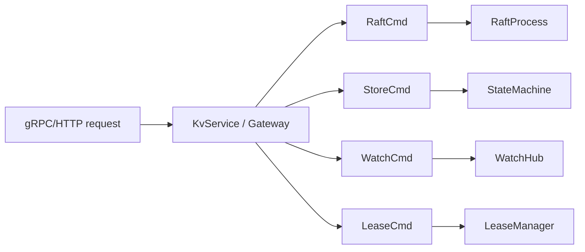

# Barkeeper Developer Guide

An etcd-compatible distributed key-value store built on the Rebar actor runtime.

---

## Prerequisites

- **Rust** (stable toolchain, edition 2021) -- install via [rustup](https://rustup.rs/)
- **protoc** (Protocol Buffers compiler) -- required by `tonic-build` to compile `.proto` files at build time
- **Git**

Verify your setup:

```bash
rustc --version    # e.g. rustc 1.XX.0 (stable)
protoc --version   # e.g. libprotoc 3.XX.X or 27.X
git --version
```

### Installing protoc

On Ubuntu/Debian:

```bash
sudo apt install -y protobuf-compiler
```

On macOS:

```bash
brew install protobuf
```

On Arch Linux:

```bash
sudo pacman -S protobuf
```

---

## Building from Source

```bash
git clone https://github.com/alexandernicholson/barkeeper.git
cd barkeeper
cargo build --release
```

The build step compiles three proto files (`proto/etcdserverpb/rpc.proto`,
`proto/etcdserverpb/kv.proto`, `proto/authpb/auth.proto`) via `tonic-build`
in `build.rs`. The generated Rust code is placed in the `target/` directory
and included at compile time through `tonic::include_proto!()` in `src/lib.rs`.

Inter-node Raft messaging uses msgpack serialization over Rebar TCP frames
rather than a separate gRPC service.

---

## Running a Single-Node Cluster

```bash
./target/release/barkeeper
```

By default the server listens on:

- **gRPC** on `127.0.0.1:2379`
- **HTTP gateway** on `127.0.0.1:2380` (always gRPC port + 1)

### CLI Flags

| Flag                   | Default          | Description                              |
|------------------------|------------------|------------------------------------------|
| `--listen-client-urls` | `127.0.0.1:2379` | Address for the gRPC client listener     |
| `--name`               | `default`        | Human-readable name for this node        |
| `--data-dir`           | `data.barkeeper`  | Directory for redb data files            |
| `--node-id`            | `1`              | Raft node identifier                     |
| `--listen-peer-urls`   | `http://localhost:2380` | URL for peer traffic              |
| `--initial-cluster`    |                  | Comma-separated cluster members (`1=http://10.0.0.1:2380,...`), or a bare hostname for DNS SRV autodiscovery |
| `--initial-cluster-state` | `new`         | `new` for fresh cluster, `existing` to join |
| `--auto-tls`           | `false`          | Auto-generate self-signed certs for client connections |
| `--cert-file`          |                  | Path to client server TLS cert file      |
| `--key-file`           |                  | Path to client server TLS key file       |
| `--trusted-ca-file`    |                  | Path to client server TLS trusted CA cert file |
| `--client-cert-auth`   | `false`          | Enable client certificate authentication |
| `--self-signed-cert-validity` | `1`       | Validity period of self-signed certs (years) |
| `--peer-auto-tls`      | `false`          | Auto-generate self-signed certs for peer connections |
| `--peer-cert-file`     |                  | Path to peer TLS cert file               |
| `--peer-key-file`      |                  | Path to peer TLS key file                |
| `--peer-trusted-ca-file` |                | Path to peer TLS trusted CA cert file    |

Example with custom settings:

```bash
./target/release/barkeeper \
  --listen-client-urls 0.0.0.0:2379 \
  --name node1 \
  --data-dir /var/lib/barkeeper \
  --node-id 1
```

---

## Testing with etcdctl

Barkeeper implements the etcd v3 gRPC API, so standard `etcdctl` commands
work out of the box.

**Put a key:**

```bash
etcdctl --endpoints=127.0.0.1:2379 put foo bar
```

**Get a key:**

```bash
etcdctl --endpoints=127.0.0.1:2379 get foo
```

**Delete a key:**

```bash
etcdctl --endpoints=127.0.0.1:2379 del foo
```

**List all keys:**

```bash
etcdctl --endpoints=127.0.0.1:2379 get "" --prefix
```

---

## Testing with curl (HTTP Gateway)

The HTTP gateway on port 2380 exposes the etcd v3 JSON API. All byte fields
(keys and values) are base64-encoded, matching etcd's grpc-gateway behavior.

### Encode keys and values

```bash
# "foo" in base64
echo -n foo | base64
# Zm9v

# "bar" in base64
echo -n bar | base64
# YmFy
```

### Put a key

```bash
curl -s http://127.0.0.1:2380/v3/kv/put \
  -d '{"key": "Zm9v", "value": "YmFy"}' | jq .
```

### Get a key

```bash
curl -s http://127.0.0.1:2380/v3/kv/range \
  -d '{"key": "Zm9v"}' | jq .
```

### Get all keys (range query)

Use `key: ""` (base64 of empty) and `range_end: "AA=="` (base64 of `\x00`)
to match all keys:

```bash
curl -s http://127.0.0.1:2380/v3/kv/range \
  -d '{"key": "", "range_end": "AA=="}' | jq .
```

### Delete a key

```bash
curl -s http://127.0.0.1:2380/v3/kv/deleterange \
  -d '{"key": "Zm9v"}' | jq .
```

### Lease grant

```bash
curl -s http://127.0.0.1:2380/v3/lease/grant \
  -d '{"TTL": 60}' | jq .
```

The response returns a lease `ID` as a string (per proto3 JSON conventions):

```json
{
  "header": { "cluster_id": "1", "member_id": "1", "raft_term": "1" },
  "ID": "1",
  "TTL": "60"
}
```

### Transaction (compare-and-swap)

Transactions check conditions and execute success or failure branches
atomically. This example sets `foo` to `baz` only if its current value is
`bar`:

```bash
curl -s http://127.0.0.1:2380/v3/kv/txn -d '{
  "compare": [{
    "key": "Zm9v",
    "target": "VALUE",
    "result": "EQUAL",
    "value": "YmFy"
  }],
  "success": [{
    "requestPut": {"key": "Zm9v", "value": "YmF6"}
  }],
  "failure": [{
    "requestRange": {"key": "Zm9v"}
  }]
}' | jq .
```

The response includes `succeeded: true` if the compare passed and the
success branch was executed.

---

## Running the Test Suite

```bash
cargo test
```

### Test Files

The test suite contains **99 tests** across 16 files:

| File                              | Tests | Description                                                     |
|-----------------------------------|-------|-----------------------------------------------------------------|
| `src/tls.rs` (unit tests)         | 7     | TLS configuration, auto-TLS cert generation, tonic/acceptor     |
| `compat_test.rs`                  | 30    | End-to-end etcd compatibility tests against the HTTP gateway    |
| `integration_test.rs`             | 5     | gRPC integration tests using tonic clients                      |
| `kv_store_test.rs`                | 8     | MVCC key-value store unit tests (put, get, range, delete, compact) |
| `lease_expiry_test.rs`            | 3     | Lease manager expiry logic unit tests                           |
| `lease_expiry_integration_test.rs`| 1     | Full-stack lease expiry test (grant, attach, expire, verify)    |
| `log_store_test.rs`               | 7     | Raft log store persistence tests (append, truncate, hard state) |
| `raft_election_test.rs`           | 9     | Raft election state machine tests (single-node, multi-node, split vote) |
| `raft_types_test.rs`              | 6     | Raft type serialization and message encoding tests              |
| `txn_test.rs`                     | 7     | Transaction (compare-and-swap) tests against the KV store       |
| `watch_notify_test.rs`            | 3     | Watch hub notification and key-matching tests                   |
| `txn_watch_test.rs`               | 2     | Watch notifications fired by transaction mutations              |
| `watch_revision_test.rs`          | 4     | Revision-based history replay and `changes_since` tests         |
| `auth_test.rs`                    | 1     | Auth enforcement (unauthenticated rejection, token validation)  |
| `cluster_test.rs`                 | 3     | Multi-node Raft cluster integration tests (election, leader)    |
| `replication_test.rs`             | 3     | Multi-node data replication tests (put, multi-put, delete)      |

---

## Project Structure

```
barkeeper/
|
|-- Cargo.toml              # Crate manifest and dependencies
|-- build.rs                # tonic-build proto compilation
|-- LICENSE                 # Apache-2.0 license
|-- README.md               # Project overview
|
|-- proto/                  # Protocol Buffer definitions
|   |-- etcdserverpb/       # etcd server proto files
|   |   |-- rpc.proto       #   KV, Watch, Lease, Cluster, Maintenance, Auth services
|   |   |-- kv.proto        #   KeyValue and Event message types (mvccpb)
|   |-- authpb/
|       |-- auth.proto      #   User, Permission, Role message types
|
|-- src/
|   |-- main.rs             # CLI entry point (clap argument parsing, TLS + cluster flags)
|   |-- lib.rs              # Crate root; declares modules, includes generated proto code
|   |-- config.rs           # ClusterConfig for multi-node cluster bootstrap
|   |-- tls.rs              # TLS configuration, auto-TLS cert generation (rcgen)
|   |
|   |-- api/                # Network-facing API layer
|   |   |-- server.rs       #   BarkeepServer: wires up all services, starts gRPC + HTTP + TLS
|   |   |-- gateway.rs      #   HTTP/JSON gateway (axum router, auth middleware, etcd compat)
|   |   |-- kv_service.rs   #   gRPC KV service (Range, Put, DeleteRange, Txn, Compact via Raft)
|   |   |-- watch_service.rs#   gRPC Watch service (bidirectional streaming)
|   |   |-- lease_service.rs#   gRPC Lease service (Grant, Revoke, KeepAlive, TimeToLive)
|   |   |-- cluster_service.rs  # gRPC Cluster service (MemberList, MemberAdd, etc.)
|   |   |-- auth_service.rs #   gRPC Auth service (AuthEnable, UserAdd, RoleAdd, etc.)
|   |   |-- maintenance_service.rs # gRPC Maintenance service (Status, Defragment, Alarm, Snapshot)
|   |
|   |-- kv/                 # Key-value storage layer
|   |   |-- store.rs        #   MVCC KV store backed by redb (put, range, delete, txn, compact, snapshot, changes_since)
|   |   |-- state_machine.rs#   Raft state machine (logs committed entries for observability)
|   |
|   |-- raft/               # Raft consensus implementation
|   |   |-- core.rs         #   Pure state machine: Event -> Vec<Action> (no I/O)
|   |   |-- node.rs         #   RaftNode actor: timers, channels, action execution, applied_index
|   |   |-- state.rs        #   Raft state types (RaftRole, PersistentState, VolatileState, LeaderState)
|   |   |-- messages.rs     #   Raft RPC message types (AppendEntries, RequestVote, InstallSnapshot)
|   |   |-- log_store.rs    #   Durable Raft log backed by redb
|   |   |-- transport.rs    #   RaftTransport trait + LocalTransport for in-process testing
|   |   |-- rebar_transport.rs  # RebarTcpTransport for multi-node clusters (msgpack over Rebar TCP frames)
|   |   |-- snapshot.rs     #   Snapshot metadata types
|   |
|   |-- watch/              # Watch notification system
|   |   |-- hub.rs          #   WatchHub: fan-out of KV events, revision-based history replay
|   |
|   |-- lease/              # Lease management
|   |   |-- manager.rs      #   In-memory lease tracking (grant, revoke, keepalive, expiry)
|   |
|   |-- cluster/            # Cluster membership
|   |   |-- manager.rs      #   In-memory cluster membership manager
|   |   |-- swim.rs         #   SWIM MembershipList actor (gossip-based failure detection)
|   |   |-- registry.rs     #   Registry actor (OR-Set CRDT distributed process name resolution)
|   |
|   |-- auth/               # Authentication and authorization
|   |   |-- manager.rs      #   RBAC auth manager (bcrypt passwords, token validation)
|   |   |-- interceptor.rs  #   gRPC auth interceptor (tower Layer for token validation)
|   |
|   |-- actors/             # Rebar actor layer
|       |-- commands.rs     #   Typed command enums for actor communication
|
|-- tests/                  # Integration and unit test files (see table above)
|
|-- benchmark/              # Performance benchmarking scripts and results
|   |-- run_barkeeper_benchmark.sh
|   |-- run_etcd_benchmark.sh
|   |-- run_perf_benchmark.sh  # HTTP throughput/latency benchmarks
|   |-- compare.sh
|   |-- results/
|   |-- RESULTS.md
|
|-- benches/                # Criterion microbenchmarks
    |-- kv_bench.rs         # KvStore benchmarks (put, range, txn)
```

---

## Debugging

Barkeeper uses the `tracing` crate for structured logging. Control log
verbosity with the `RUST_LOG` environment variable.

### General debug logging

```bash
RUST_LOG=debug cargo run
```

### Trace a specific module

```bash
RUST_LOG=barkeeper::raft=trace cargo run
```

### Combine multiple filters

```bash
RUST_LOG=barkeeper::raft=trace,barkeeper::kv=debug,barkeeper::api=info cargo run
```

### Common modules for filtering

| Module               | What it logs                                          |
|----------------------|-------------------------------------------------------|
| `barkeeper::raft`    | Election, heartbeat, log replication, term changes    |
| `barkeeper::kv`      | Put, delete, range, txn, compact operations           |
| `barkeeper::api`     | gRPC and HTTP gateway request handling                |
| `barkeeper::actors`  | Actor lifecycle, command dispatch                     |

---

## Code Conventions

### Pure state machine pattern for Raft

The Raft implementation in `raft/core.rs` is a pure state machine with no
I/O. It exposes a single method:

```rust
pub fn step(&mut self, event: Event) -> Vec<Action>
```

`Event` variants represent inputs (election timeout, heartbeat timeout,
peer messages, client proposals). `Action` variants represent side effects
the caller must perform (persist state, append to log, send messages, start
timers). This separation makes the Raft logic deterministic and easy to
test without real timers or networking.

The actor in `raft/node.rs` runs the event loop: it receives events from
timers and channels, calls `core.step()`, and executes the returned actions.

### Actor-per-concern with typed channels

Each subsystem runs as its own async task communicating through typed
`tokio::sync::mpsc` channels. Command enums in `actors/commands.rs` define
the message vocabulary:



Each command enum carries a `oneshot::Sender` for the response, giving
the caller a typed future to await.

### Proto3 JSON conventions

The HTTP gateway follows proto3 canonical JSON mapping:

- **int64/uint64 fields** are serialized as JSON strings (e.g. `"42"`, not `42`)
- **Fields with default values** (0, false, empty string/vec) are omitted from responses
- **Byte fields** (key, value) are base64-encoded

These conventions are implemented via custom serde serializers and
`skip_serializing_if` attributes in `api/gateway.rs`.

### MVCC compound keys

The KV store uses Multi-Version Concurrency Control. Each mutation creates
a new revision. Keys are stored in redb with compound keys that encode both
the user key and the revision:

```
compound_key = user_key_bytes + 0x00 + revision_as_8_byte_big_endian
```

This layout provides:

- **Lexicographic ordering** -- all versions of a key are stored contiguously
- **Efficient range scans** -- a range query over `[key, range_end)` naturally
  iterates compound keys in key-then-revision order
- **Point-in-time reads** -- range queries can specify a revision to read
  historical state

A separate revision table maps each revision number to the list of keys
affected, enabling efficient watch catch-up and compaction.
