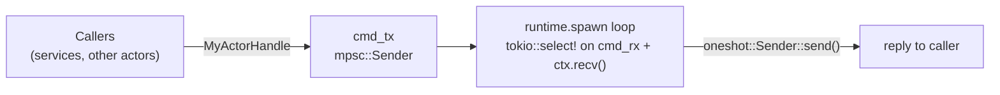
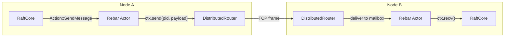

# Extending Barkeeper

This guide covers the main extension points in barkeeper: adding gRPC services,
actor processes, Raft transports, HTTP gateway endpoints, and compatibility tests.

All paths are relative to the repository root unless noted otherwise.

---

## 1. Adding a New gRPC Service

Barkeeper uses [tonic](https://github.com/hyperium/tonic) for gRPC with proto
definitions compiled by `tonic-build` at build time. The existing services
(KV, Watch, Lease, Cluster, Maintenance, Auth) each follow the same pattern.

### Step 1: Define proto messages

Add your service definition and messages to `proto/etcdserverpb/rpc.proto`
(or create a new `.proto` file). For example:

```protobuf
service MyService {
  rpc MyMethod(MyRequest) returns (MyResponse) {}
}

message MyRequest {
  bytes key = 1;
}

message MyResponse {
  ResponseHeader header = 1;
  string result = 2;
}
```

If you create a new `.proto` file, register it in `build.rs` alongside the
existing protos:

```rust
tonic_build::configure()
    .build_server(true)
    .build_client(false)
    .compile_protos(
        &[
            "proto/etcdserverpb/rpc.proto",
            "proto/etcdserverpb/kv.proto",
            "proto/authpb/auth.proto",
            "proto/myservicepb/my_service.proto", // <-- new
        ],
        &["proto/"],
    )?;
```

### Step 2: Regenerate Rust code

Run `cargo build`. The `build.rs` script invokes `tonic-build` which reads
the `.proto` files and generates Rust types and a server trait under the
`crate::proto` module tree. The generated trait for the example above would
be `my_service_server::MyService`.

### Step 3: Create the service struct

Create `src/api/my_service.rs`. Follow the pattern established by
`src/api/kv_service.rs`:

```rust
use std::sync::atomic::{AtomicU64, Ordering};
use std::sync::Arc;

use tonic::{Request, Response, Status};

use crate::proto::etcdserverpb::my_service_server::MyService as MyServiceTrait;
use crate::proto::etcdserverpb::{MyRequest, MyResponse, ResponseHeader};

pub struct MyService {
    cluster_id: u64,
    member_id: u64,
    raft_term: Arc<AtomicU64>,
}

impl MyService {
    pub fn new(
        cluster_id: u64,
        member_id: u64,
        raft_term: Arc<AtomicU64>,
    ) -> Self {
        MyService { cluster_id, member_id, raft_term }
    }

    fn make_header(&self, revision: i64) -> Option<ResponseHeader> {
        Some(ResponseHeader {
            cluster_id: self.cluster_id,
            member_id: self.member_id,
            revision,
            raft_term: self.raft_term.load(Ordering::Relaxed),
        })
    }
}

#[tonic::async_trait]
impl MyServiceTrait for MyService {
    async fn my_method(
        &self,
        request: Request<MyRequest>,
    ) -> Result<Response<MyResponse>, Status> {
        let req = request.into_inner();
        // ... implementation ...
        Ok(Response::new(MyResponse {
            header: self.make_header(0),
            result: "ok".to_string(),
        }))
    }
}
```

Key conventions:
- The service struct holds `Arc` references to shared state (store, watch hub,
  lease manager, etc.) plus `cluster_id`, `member_id`, and `raft_term`.
- `make_header()` produces a `ResponseHeader` with the current Raft term.
- Errors are returned as `tonic::Status` (e.g., `Status::internal(...)`).

### Step 4: Wire into the server

In `src/api/server.rs`, import your service and its generated server wrapper,
then add it to the tonic `Server::builder()` chain:

```rust
use crate::api::my_service::MyService;
use crate::proto::etcdserverpb::my_service_server::MyServiceServer;

// Inside BarkeepServer::start():
let my_service = MyService::new(cluster_id, member_id, Arc::clone(&raft_term));

Server::builder()
    .add_service(KvServer::new(kv_service))
    .add_service(WatchServer::new(watch_service))
    // ... existing services ...
    .add_service(MyServiceServer::new(my_service))  // <-- new
    .serve(addr)
    .await?;
```

Don't forget to add `pub mod my_service;` to `src/api/mod.rs`.

---

## 2. Adding a New Rebar Actor

Barkeeper uses the actor-per-concern pattern with typed command channels.
Each actor is spawned as a Rebar process using `runtime.spawn()`, receiving
commands via `mpsc::Receiver<T>` and Rebar messages via `ctx.recv()`.
Results are sent back through `oneshot` channels.

### Step 1: Define the command enum

Add your command type in `src/actors/commands.rs`. Follow the existing pattern
of typed enums with `oneshot::Sender` reply channels:

```rust
use tokio::sync::oneshot;

/// Commands sent to the MyActor.
pub enum MyCmd {
    /// Do something and return the result.
    DoWork {
        input: Vec<u8>,
        reply: oneshot::Sender<Result<MyResult, String>>,
    },
    /// Fire-and-forget notification.
    Notify {
        data: String,
    },
}

pub struct MyResult {
    pub output: Vec<u8>,
}
```

The existing command enums demonstrate two patterns:
- **Request-reply**: include a `reply: oneshot::Sender<Result<T, E>>` field
  (see `KvStoreCmd::Put`, `AuthCmd::Authenticate`).
- **Fire-and-forget**: no reply channel (see `WatchHubCmd::Notify`).

### Step 2: Create the actor module

Create a `actor.rs` file in the appropriate module directory (e.g.,
`src/my_module/actor.rs`). Follow the pattern established by
`src/cluster/actor.rs`, `src/auth/actor.rs`, `src/kv/actor.rs`, and
`src/watch/actor.rs`:

```rust
use tokio::sync::{mpsc, oneshot};
use rebar_core::runtime::Runtime;
use crate::actors::commands::MyCmd;

/// Spawn the MyActor. Returns a handle for submitting commands.
pub async fn spawn_my_actor(runtime: &Runtime) -> MyActorHandle {
    let (cmd_tx, mut cmd_rx) = mpsc::channel::<MyCmd>(256);

    runtime.spawn(move |mut ctx| async move {
        loop {
            tokio::select! {
                Some(cmd) = cmd_rx.recv() => {
                    match cmd {
                        MyCmd::DoWork { input, reply } => {
                            let result = MyResult { output: input };
                            let _ = reply.send(Ok(result));
                        }
                        MyCmd::Notify { data } => {
                            tracing::info!(%data, "notification received");
                        }
                    }
                }
                Some(_msg) = ctx.recv() => {
                    // Reserved for distributed Rebar messages.
                }
                else => break,
            }
        }
    });

    MyActorHandle { cmd_tx }
}

/// Cloneable handle for interacting with the MyActor.
#[derive(Clone)]
pub struct MyActorHandle {
    cmd_tx: mpsc::Sender<MyCmd>,
}

impl MyActorHandle {
    pub async fn do_work(&self, input: Vec<u8>) -> Result<MyResult, String> {
        let (reply, rx) = oneshot::channel();
        self.cmd_tx
            .send(MyCmd::DoWork { input, reply })
            .await
            .expect("my actor dead");
        rx.await.expect("my actor dropped")
    }

    pub async fn notify(&self, data: String) {
        let _ = self.cmd_tx
            .send(MyCmd::Notify { data })
            .await;
    }
}
```

The architecture for a Rebar actor:



Key conventions:
- Channel buffer size is 256 (matching all existing actors).
- The actor loop uses `tokio::select!` on both `cmd_rx.recv()` (typed
  commands) and `ctx.recv()` (Rebar distributed messages).
- The spawn function returns a `MyActorHandle` (not a raw `Sender`).
- Handle methods use `.expect("actor dead")` for consistent error handling.
- For blocking operations (e.g., file I/O, bcrypt), use
  `tokio::task::spawn_blocking` inside the actor to avoid blocking the loop.

### Step 3: Wire into the server

In `src/api/server.rs`, create a `Runtime` for your actor and spawn it:

```rust
let my_runtime = Runtime::new(config.node_id);
let my_handle = spawn_my_actor(&my_runtime).await;
```

Pass the handle to any services that need it.

### Step 4: Update module declarations

Add `pub mod actor;` to your module's `mod.rs` file.

---

## 3. Inter-Node Raft Transport

Inter-node Raft messaging uses Rebar's `DistributedRuntime` with TCP
frames. There is no separate transport trait — the Raft actor
(`spawn_raft_node_rebar` in `src/raft/node.rs`) sends messages directly
via the Rebar `ProcessContext::send()` API.

### Message flow

`RaftMessage` is an enum wrapping all Raft RPCs:

```rust
pub enum RaftMessage {
    AppendEntriesReq(AppendEntriesRequest),
    AppendEntriesResp(AppendEntriesResponse),
    RequestVoteReq(RequestVoteRequest),
    RequestVoteResp(RequestVoteResponse),
    InstallSnapshotReq(InstallSnapshotRequest),
    InstallSnapshotResp(InstallSnapshotResponse),
}
```

Messages are serialized with msgpack using `raft_message_to_value()` and
`raft_message_from_value()` in `src/raft/messages.rs`.

When the Raft core emits `Action::SendMessage { to, message }`, the actor
looks up the target node's `ProcessId` from a shared peer map and calls
`ctx.send(pid, payload)`. The Rebar `DistributedRouter` routes local
messages directly and remote messages over TCP frames.

Inbound messages arrive through the Rebar actor mailbox via `ctx.recv()`.



### Peer discovery

Each Raft actor registers itself in a shared `Registry` (OR-Set CRDT) as
`raft:{node_id}`. Peer PIDs are resolved from the registry and stored in
a `HashMap<u64, ProcessId>` shared via `Arc<Mutex<...>>`

---

## 4. Adding HTTP Gateway Endpoints

The HTTP/JSON gateway in `src/api/gateway.rs` mirrors etcd's grpc-gateway,
accepting JSON POST requests and returning proto3-compatible JSON responses.
It is built with [axum](https://github.com/tokio-rs/axum).

### Handler pattern

Every handler follows the same structure:

```rust
async fn handle_my_endpoint(
    State(state): State<GatewayState>,
    body: axum::body::Bytes,
) -> impl IntoResponse {
    let req: MyRequest = parse_json(&body);
    let key = decode_b64(&req.key);

    match do_something(&state, &key) {
        Ok(result) => {
            let rev = state.store.current_revision().unwrap_or(0);
            axum::Json(MyResponse {
                header: state.make_header(rev),
                // ... fields ...
            })
            .into_response()
        }
        Err(e) => json_error(
            StatusCode::INTERNAL_SERVER_ERROR,
            format!("my_endpoint: {}", e),
        )
        .into_response(),
    }
}
```

Key helpers:
- `parse_json(&body)` -- Deserializes JSON without requiring a Content-Type
  header. Returns `T::default()` for empty bodies.
- `decode_b64(&option_string)` -- Decodes a base64-encoded `Option<String>`
  to `Vec<u8>`, matching etcd's convention for byte fields.
- `proto_kv_to_json(&kv)` -- Converts a proto `KeyValue` to the JSON
  representation with base64-encoded key/value fields.
- `state.make_header(revision)` -- Builds a `JsonResponseHeader` with
  current cluster ID, member ID, and Raft term.
- `json_error(status, msg)` -- Returns a JSON error body matching etcd's
  error format.

### GatewayState

All handlers share `GatewayState` via axum's state extraction:

```rust
#[derive(Clone)]
pub struct GatewayState {
    pub store: KvStoreActorHandle,
    pub watch_hub: WatchHubActorHandle,
    pub lease_manager: Arc<LeaseManager>,
    pub cluster_manager: ClusterActorHandle,
    pub auth_manager: AuthActorHandle,
    pub alarms: Arc<Mutex<Vec<AlarmMember>>>,
    pub cluster_id: u64,
    pub member_id: u64,
    pub raft_term: Arc<AtomicU64>,
    pub raft_handle: RaftHandle,
}
```

If your endpoint needs additional shared state, add it here and thread it
through from `create_router()` and `BarkeepServer::start()`.

### Wire into the router

Add your route in the `create_router()` function:

```rust
pub fn create_router(/* ... */) -> Router {
    // ...
    Router::new()
        .route("/v3/kv/range", post(handle_range))
        .route("/v3/kv/put", post(handle_put))
        // ... existing routes ...
        .route("/v3/my/endpoint", post(handle_my_endpoint))  // <-- new
        .with_state(state)
}
```

### Proto3 JSON conventions

Barkeeper follows etcd's proto3 canonical JSON mapping. When adding new
response types, apply these rules:

- **int64/uint64 fields**: Serialize as strings using `#[serde(serialize_with = "ser_str_i64")]`
  or `#[serde(serialize_with = "ser_str_u64")]`.
- **Default value omission**: Fields with zero/false/empty values are omitted
  using `#[serde(skip_serializing_if = "...")]`.
- **Byte fields**: Base64-encoded in both requests and responses.
- **camelCase field names**: Use `#[serde(rename = "fieldName")]` where the
  proto field name differs from Rust naming conventions.

Example response struct:

```rust
#[derive(Debug, Serialize)]
struct MyResponse {
    header: JsonResponseHeader,
    #[serde(skip_serializing_if = "is_zero_i64", serialize_with = "ser_str_i64")]
    count: i64,
    #[serde(skip_serializing_if = "is_empty_vec")]
    items: Vec<JsonKeyValue>,
    #[serde(rename = "myField", skip_serializing_if = "is_false")]
    my_field: bool,
}
```

### Path conventions

Follow etcd's grpc-gateway URL structure:

```
/v3/kv/range          -- KV Range
/v3/kv/put            -- KV Put
/v3/kv/deleterange    -- KV DeleteRange
/v3/kv/txn            -- KV Txn
/v3/kv/compaction     -- KV Compaction
/v3/lease/grant       -- Lease Grant
/v3/lease/revoke      -- Lease Revoke
/v3/lease/timetolive  -- Lease TimeToLive
/v3/lease/leases      -- Lease Leases
/v3/cluster/member/list  -- Cluster MemberList
/v3/maintenance/status      -- Maintenance Status
/v3/maintenance/defragment  -- Maintenance Defragment
/v3/maintenance/alarm       -- Maintenance Alarm
/v3/maintenance/snapshot    -- Maintenance Snapshot
/v3/watch                   -- Watch (SSE stream)
/v3/auth/enable       -- Auth Enable
/v3/auth/disable      -- Auth Disable
/v3/auth/status       -- Auth Status
/v3/auth/authenticate -- Auth Authenticate
/v3/auth/user/add     -- User Add
```

All endpoints use `POST` method. This matches etcd's grpc-gateway behavior
where even read operations use POST with a JSON body.

---

## 5. Writing Compatibility Tests

Compatibility tests in `tests/compat_test.rs` verify behavioral parity with
etcd's v3 HTTP API. Each test starts a full barkeeper instance and makes HTTP
requests against it.

### Test instance setup

Use `start_test_instance()` to spin up a minimal barkeeper with Raft, KV store,
and HTTP gateway on random ports:

```rust
async fn start_test_instance() -> (SocketAddr, tempfile::TempDir) {
    let dir = tempfile::tempdir().unwrap();

    let config = RaftConfig {
        node_id: 1,
        data_dir: dir.path().to_string_lossy().to_string(),
        ..Default::default()
    };

    // All components are accessed through Rebar actor handles.
    let kv_store = KvStore::open(dir.path().join("kv.redb")).expect("open KvStore");
    let kv_runtime = Runtime::new(1);
    let store = spawn_kv_store_actor(&kv_runtime, kv_store).await;

    let (apply_tx, apply_rx) = mpsc::channel(256);
    spawn_state_machine(apply_rx).await;
    let raft_handle = spawn_raft_node(config, apply_tx).await;

    let lease_manager = Arc::new(LeaseManager::new());
    let cluster_runtime = Runtime::new(1);
    let cluster_manager = spawn_cluster_actor(&cluster_runtime, 1).await;
    cluster_manager
        .add_initial_member(1, "test-node".to_string(), vec![], vec![])
        .await;

    let watch_runtime = Runtime::new(1);
    let watch_hub = spawn_watch_hub_actor(&watch_runtime, Some(store.clone())).await;
    let auth_runtime = Runtime::new(1);
    let auth_manager = spawn_auth_actor(&auth_runtime).await;

    // ... lease expiry timer, router setup, HTTP listener ...

    (bound_addr, dir)
}
```

Note: All shared components (KvStore, WatchHub, ClusterManager, AuthManager)
are accessed through Rebar actor handles — no `Arc<T>` wrappers needed.
The `TempDir` is returned and held by the test to keep the data directory
alive for the duration of the test. Dropping it cleans up automatically.

### Writing a test

Each test follows the pattern: start instance, make HTTP requests, assert
JSON responses.

```rust
#[tokio::test]
async fn test_my_feature() {
    let (addr, _dir) = start_test_instance().await;
    let client = Client::new();
    let base = format!("http://{}", addr);

    // Write data.
    let resp = client
        .post(format!("{}/v3/kv/put", base))
        .json(&json!({"key": b64("mykey"), "value": b64("myval")}))
        .send()
        .await
        .unwrap();
    assert!(resp.status().is_success());
    let body: Value = resp.json().await.unwrap();

    // Verify response structure.
    assert!(body["header"].is_object());
    assert!(str_i64(&body["header"]["revision"]) > 0);

    // Read back and verify.
    let resp = client
        .post(format!("{}/v3/kv/range", base))
        .json(&json!({"key": b64("mykey")}))
        .send()
        .await
        .unwrap();
    let body: Value = resp.json().await.unwrap();
    let kvs = body["kvs"].as_array().unwrap();
    assert_eq!(kvs.len(), 1);
    assert_eq!(b64_decode(kvs[0]["value"].as_str().unwrap()), "myval");
}
```

### Helper functions

The test file provides these helpers:

```rust
fn b64(s: &str) -> String {
    B64.encode(s.as_bytes())
}

fn b64_decode(s: &str) -> String {
    String::from_utf8(B64.decode(s).unwrap()).unwrap()
}

/// Parse string-encoded i64 (proto3 JSON convention).
fn str_i64(val: &Value) -> i64 {
    val.as_str()
        .and_then(|s| s.parse::<i64>().ok())
        .or_else(|| val.as_i64())
        .expect("expected string-encoded i64")
}

/// Parse string-encoded u64 (proto3 JSON convention).
fn str_u64(val: &Value) -> u64 {
    val.as_str()
        .and_then(|s| s.parse::<u64>().ok())
        .or_else(|| val.as_u64())
        .expect("expected string-encoded u64")
}
```

### Proto3 JSON conventions to follow in assertions

When writing assertions, keep these proto3 rules in mind:

- **Numeric fields are strings**: `cluster_id`, `member_id`, `revision`,
  `raft_term`, `version`, `create_revision`, `mod_revision`, `deleted`,
  `count`, `ID`, `TTL`, `grantedTTL`, `dbSize`, `leader`, `raftIndex`,
  `raftTerm`, `raftAppliedIndex`, `dbSizeInUse` are all serialized as
  JSON strings. Use `str_i64()` and `str_u64()` to parse them.
- **Default values are omitted**: Fields with value `0`, `false`, `""`, or
  `[]` should not appear in the response. Test for absence:
  ```rust
  assert!(body.get("deleted").is_none() || str_i64(&body["deleted"]) == 0);
  ```
- **Byte fields are base64**: `key`, `value`, and `keys` (in lease TTL
  responses) are base64-encoded strings.

### Benchmarking against real etcd

The `benchmark/` directory contains scripts for capturing reference output
from a real etcd instance and comparing it with barkeeper:

- `benchmark/run_etcd_benchmark.sh` -- Starts a single-node etcd and runs
  all API operations, saving JSON output to `benchmark/results/etcd/`.
- `benchmark/run_barkeeper_benchmark.sh` -- Runs the same operations against
  a barkeeper instance, saving to `benchmark/results/barkeeper/`.
- `benchmark/compare.sh` -- Diffs the results side by side.

To add a new benchmark case:

1. Add the `curl` command to both `run_etcd_benchmark.sh` and
   `run_barkeeper_benchmark.sh`.
2. Save output to matching filenames under `results/etcd/` and
   `results/barkeeper/`.
3. Run `benchmark/compare.sh` to verify parity.

### Running tests

```bash
# Run all compatibility tests
cargo test --test compat_test

# Run a specific test
cargo test --test compat_test test_kv_put_basic

# Run with output
cargo test --test compat_test -- --nocapture
```
