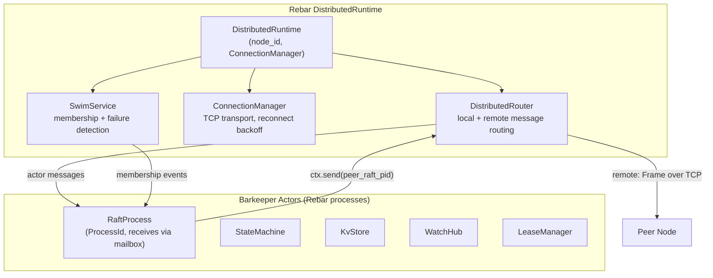
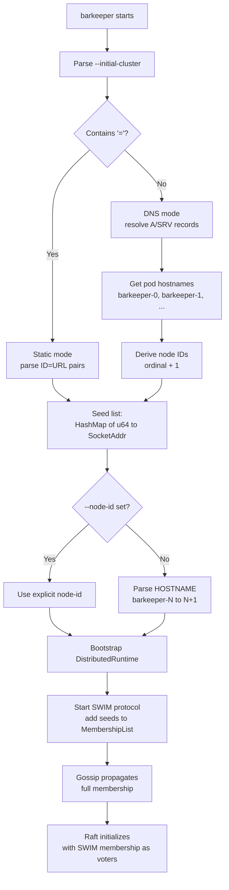
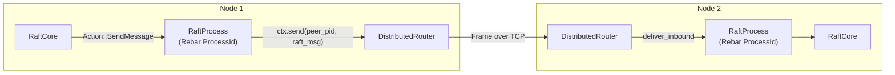

# SWIM Cluster Integration Design

**Date:** 2026-03-04
**Status:** Approved

## Summary

Replace barkeeper's custom gRPC-based cluster transport and manual cluster
management with Rebar's `DistributedRuntime`, SWIM membership protocol, and
TCP frame transport. Raft stays for data consensus. SWIM handles cluster
membership and failure detection. All actors become proper Rebar distributed
processes.

## Decisions

| Decision | Choice |
|----------|--------|
| Keep Raft for data consensus? | Yes (required for etcd linearizable semantics) |
| SWIM role | Cluster membership discovery + failure detection |
| Integration depth | Approach B: full DistributedRuntime + distributed actors |
| Transport | Rebar TCP frames (QUIC opt-in later) |
| `--initial-cluster` magic | Bare hostname = DNS seed discovery; `ID=URL` = static mode |
| Node ID assignment | Auto from hostname ordinal (`barkeeper-0` → 1); `--node-id` as override |
| Single-node mode | Same code path — DistributedRuntime with empty peer list |
| Peer PID discovery | Global Registry — each RaftProcess registers as `"raft:{node_id}"` |

## Architecture

### Before (Current)

```
Runtime (local only)
├── GrpcRaftTransport (tonic gRPC for Raft RPCs)
├── ClusterManager (in-memory member list, manual)
├── RaftProcess (tokio::spawn, mpsc channels)
└── No failure detection
```

### After

```
DistributedRuntime (cluster-aware)
├── DistributedRouter (local + remote message routing)
├── ConnectionManager (TCP transport, exponential backoff reconnect)
├── SWIM (MembershipList + FailureDetector + GossipQueue)
├── Global Registry (OR-Set CRDT, "raft:{node_id}" → ProcessId)
├── RaftProcess (Rebar process, ctx.recv/ctx.send for messages)
├── NodeDrain (3-phase graceful shutdown)
└── All actors are Rebar processes via runtime.spawn()
```

### Data Flow



## Startup and Discovery Flow



### DNS Resolution

For a bare hostname like `barkeeper.default.svc.cluster.local`:

1. Attempt SRV lookup on `_peer._tcp.{hostname}` (preferred — includes port)
2. Fall back to A record lookup on `{hostname}` + peer port from `--listen-peer-urls`
3. Each resolved address maps to a pod; hostname-based ordinal derives node IDs

### Node ID Derivation

Parse `HOSTNAME` env var to extract StatefulSet ordinal:
- `barkeeper-0` → node ID 1
- `barkeeper-2` → node ID 3
- `my-app-42` → node ID 43
- No ordinal match → fall back to requiring `--node-id`

## Raft as Distributed Rebar Actors

### Current Flow (Replaced)

1. RaftCore emits `Action::SendMessage { to: node_id, message }`
2. Actor calls `GrpcRaftTransport.send(to, message)` → tonic gRPC call
3. `RaftTransportServer` receives → pushes to inbound mpsc channel
4. Actor's select loop picks it up → feeds to `RaftCore.step(Event::Message)`

### New Flow

1. RaftCore emits `Action::SendMessage { to: node_id, message }`
2. Actor looks up peer's ProcessId from `peers: HashMap<u64, ProcessId>`
3. Actor calls `ctx.send(peer_pid, serialize(message))` → DistributedRouter routes it
4. If remote: encoded as Frame → TCP → `deliver_inbound` on peer node
5. Peer RaftProcess receives via `ctx.recv()` → deserializes → `RaftCore.step()`



### Peer PID Discovery (Global Registry)

Each RaftProcess registers itself in Rebar's OR-Set CRDT Global Registry as
`"raft:{node_id}"`. When SWIM reports a new Alive member:

1. Wait for peer's RaftProcess to register as `"raft:{node_id}"`
2. `registry.lookup("raft:2")` → returns ProcessId
3. Add to local `peers: HashMap<u64, ProcessId>` map
4. RaftCore can now send messages to this peer

Re-registration after process restart is handled by the Registry's LWW
conflict resolution (timestamp-based, higher node_id tiebreaker).

## SWIM Membership → Raft Voter Sync

Every barkeeper node boots the same way — no single-node special case:

1. Start DistributedRuntime with TCP transport
2. Start SWIM protocol
3. If `--initial-cluster` is set, add seeds to MembershipList
4. If no seeds (single-node), SWIM runs with empty member list
5. RaftProcess registers itself in Global Registry
6. Raft initializes with current SWIM alive members as voters

### Membership Change Events

| SWIM Event | Action |
|------------|--------|
| `Alive { node_id, addr }` | ConnectionManager connects. Wait for Registry entry. Add to peers map. Inform Raft of new voter. |
| `Suspect { node_id }` | No Raft action (Raft handles via heartbeat timeouts) |
| `Dead { node_id }` | Remove from peers map. Raft leader stops sending AppendEntries. Quorum still works if majority alive. |
| `Leave { node_id }` | Same as Dead but cleaner — drain completed first |

### Important Constraint

SWIM informs Raft of the physical topology. Raft's own config change mechanism
(log-based) handles the logical voter set. A SWIM Dead node might come back —
Raft's term/log mechanism handles this correctly. SWIM is an optimization
(stop trying to send to unreachable nodes), not a hard removal.

## What Gets Removed

| File | What | Replaced By |
|------|------|-------------|
| `src/raft/grpc_transport.rs` | GrpcRaftTransport + RaftTransportServer | DistributedRouter + Rebar TCP frames |
| `src/raft/transport.rs` | RaftTransport trait + LocalTransport | DistributedRouter (local = same node routing) |
| `src/cluster/manager.rs` | ClusterManager (in-memory member list) | SWIM MembershipList + Global Registry |
| `proto/raftpb/raft_transport.proto` | gRPC Raft transport service definition | No longer needed (Rebar frames) |
| `src/api/cluster_service.rs` | gRPC Cluster service | Reimplemented on top of SWIM membership |

## What Stays Unchanged

| File | What | Why |
|------|------|-----|
| `src/raft/core.rs` | Pure Event → Vec Action state machine | Zero I/O, pure logic |
| `src/raft/state.rs` | RaftState, RaftRole, PersistentState | Data types, no transport coupling |
| `src/raft/messages.rs` | RaftMessage, LogEntry, all RPC types | Same types, serialized to msgpack |
| `src/raft/log_store.rs` | Durable Raft log (redb) | Storage layer |
| `src/raft/snapshot.rs` | Snapshot types | Storage layer |
| `src/kv/*` | KvStore, StateMachine | Data layer |
| `src/watch/*` | WatchHub | Notification layer |
| `src/lease/*` | LeaseManager | TTL layer |
| `src/auth/*` | AuthManager, interceptor | Auth layer |
| `src/api/kv_service.rs` | gRPC KV service | Client-facing |
| `src/api/watch_service.rs` | gRPC Watch service | Client-facing |
| `src/api/lease_service.rs` | gRPC Lease service | Client-facing |
| `src/api/auth_service.rs` | gRPC Auth service | Client-facing |
| `src/api/maintenance_service.rs` | gRPC Maintenance service | Client-facing |
| `src/api/gateway.rs` | HTTP/JSON gateway | Client-facing |
| `src/tls.rs` | TLS for client connections | Client TLS stays; peer TLS moves to Rebar QUIC later |

## What Gets Modified

| File | What Changes |
|------|-------------|
| `src/raft/node.rs` | `spawn_raft_node` becomes a Rebar process via `runtime.spawn()`. Receives Raft messages via `ctx.recv()`. Sends via `ctx.send(peer_pid)`. Registers as `"raft:{node_id}"` in Global Registry. |
| `src/api/server.rs` | Creates DistributedRuntime instead of Runtime. Bootstraps SWIM. Spawns all actors as Rebar processes. Runs `process_outbound()` event loop. |
| `src/main.rs` | `--initial-cluster` parsing: detect DNS vs static. Hostname-based node ID derivation. TCP transport setup. |
| `src/config.rs` | ClusterConfig updated for DNS discovery mode + SWIM config |
| `src/actors/commands.rs` | May simplify — Rebar actors use mailbox recv() instead of typed mpsc channels |

## New Files

| File | Purpose |
|------|---------|
| `src/cluster/swim_service.rs` | Runs SWIM protocol loop: tick, probe, gossip, failure detection. Emits membership change events. |
| `src/cluster/discovery.rs` | DNS seed resolution (A/SRV records) for `--initial-cluster` magic |
| `src/cluster/membership_sync.rs` | Bridges SWIM membership events → Raft voter set + peer PID map |

## Testing Strategy (TDD)

Tests are written before implementation. Each layer is tested independently
before integration. All 99 existing tests must pass unchanged.

### New Unit Tests

| Test file | What it tests |
|-----------|--------------|
| `tests/swim_discovery_test.rs` | DNS seed resolution: bare hostname → SRV/A lookup → HashMap. Hostname ordinal parsing: `barkeeper-0` → 1, `my-app-42` → 43, `no-ordinal` → error. `--initial-cluster` format detection: contains `=` → static, bare hostname → DNS. |
| `tests/swim_membership_test.rs` | SWIM MembershipList ↔ Raft voter sync: Alive event adds voter, Dead event removes from peers map. Gossip propagation: seed node → full membership. Graceful Leave via NodeDrain. |
| `tests/rebar_raft_transport_test.rs` | Raft messages encoded as Rebar Frames (msgpack). Round-trip: RaftMessage → rmpv::Value → Frame → deserialize → same RaftMessage. Sent via DistributedRouter, delivered via deliver_inbound. |
| `tests/registry_raft_test.rs` | RaftProcess registers as `"raft:{node_id}"` in Global Registry. Lookup finds correct ProcessId. Re-registration after process restart. |

### Modified Integration Tests

| Test file | What changes |
|-----------|-------------|
| `tests/cluster_test.rs` | Replace LocalTransport with DistributedRuntime + in-process TCP. Same 3 tests but over Rebar transport. |
| `tests/replication_test.rs` | Same 3 tests but nodes are Rebar distributed actors. SWIM discovers peers. |

### Existing Tests (Must Pass Unchanged)

All 99 existing tests pass without modification. Single-node tests use
DistributedRuntime with no peers — same behavior as today.

### TDD Flow

1. Write failing test
2. Implement minimum code to pass
3. Refactor
4. Move to next test

## etcd API Compatibility

Zero changes to the etcd API surface:

- All gRPC services (KV, Watch, Lease, Cluster, Maintenance, Auth)
- All HTTP gateway endpoints
- Proto3 JSON conventions (int64 as strings, default omission, base64 bytes)
- Watch SSE streaming
- Auth enforcement (HTTP middleware + gRPC interceptor)
- Linearizable writes via Raft
- Serializable reads from KvStore
- MVCC revision history and compaction
- Lease TTL management and expiry

The Cluster service (MemberList, MemberAdd, MemberRemove, etc.) is
reimplemented on top of SWIM membership but exposes the same gRPC/HTTP API.
